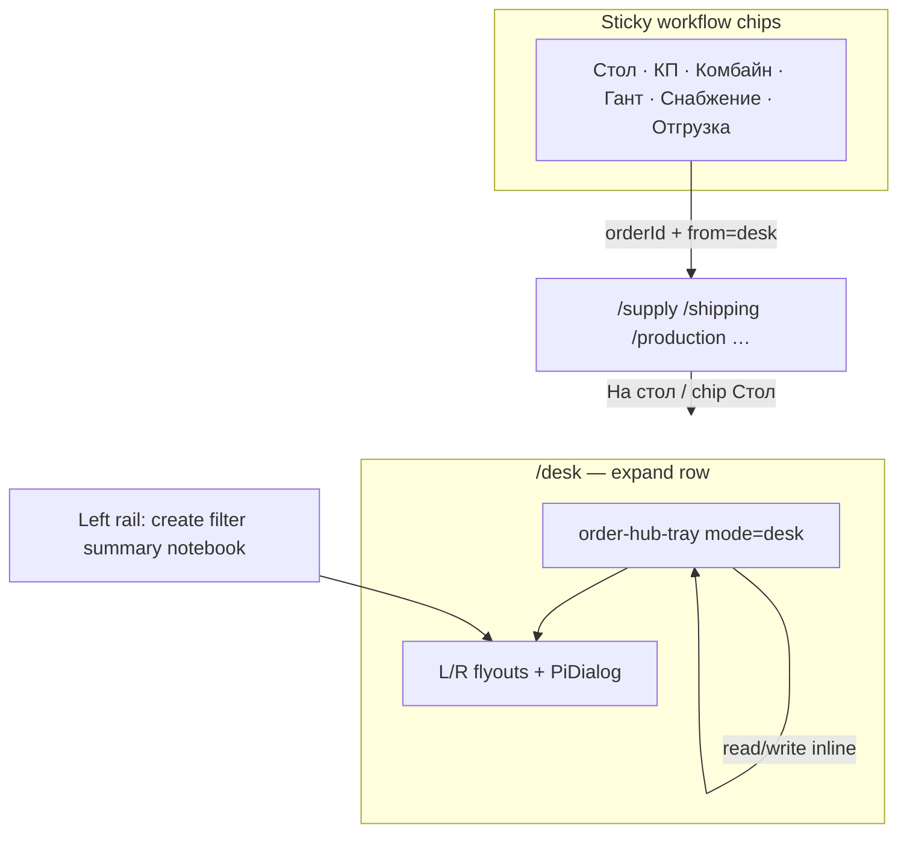

# Аудит: рабочий стол — tray как рабочее место (не набор ссылок)

**Дата:** 2026-08-23  
**Статус:** принято PO; реализация — волна DESK-425…429  
**Скрин PO:** expand заказа З-2026-003 на `/desk`  
**Канон после аудита:** tray = единственное рабочее место заказа; переходы на другие **страницы** только через workflow chips (хлебные крошки), с переносом `orderId`.

---

## 1. Суть претензии PO (дословный смысл)

| # | Требование PO | Сейчас в продукте | Вердикт |
|---|---------------|-------------------|---------|
| 1 | Раскрытый заказ = **состояние заказа + действия здесь** | Tray показывает факты, но многие CTA **уводят на другие маршруты** | **FAIL** |
| 2 | Из tray **нельзя** перескакивать на другие страницы | `routerLink` и `router.navigate` из tray/handlers | **FAIL** |
| 3 | Допустимо: **диалог / flyout**; после закрытия — тот же expand | Flyouts частично есть (`panel=bom`, notebook); supply/docs/production — navigate | **PARTIAL** |
| 4 | Workflow chips (Стол·КП·Комбайн·Гант·Снабжение·Отгрузка) **могут** вести на другие страницы | Chips есть, но **без `orderId`** на Снабжение/Отгрузка | **FAIL** |
| 5 | При переходе по chip — **фильтр по выбранному заказу** | `/supply?view=quick` без orderId; shipping без orderId | **FAIL** |
| 6 | Возврат: chip «Стол» / «На стол» / браузер назад — **orderId сохранён** | `from=desk` только на production (DESK-404/416), не на supply/shipping chips | **PARTIAL** |
| 7 | Боковые icon-rails **не дублируют** chips | Правый rail: edit/client/bom/docs/supply + «На Ганте»/«В комбайне» — дубль tray + chips | **FAIL** |
| 8 | Текст **не прилипает** к краям карточек | Tray cards `p-3`, tree `pl-4`, мало воздуха у hairline | **FAIL** (визуально) |
| 9 | Disclosure («Снабжение и производство», «Логистика…») **очевидно кликабельны** | Заголовок = button, но «раскрыть» — мелкий muted text справа | **FAIL** (affordance) |
| 10 | На `/supply` **лишний зазор** над тёмной TOC-строкой | `[chips]="emptyChips"` → пустая gold-row всё равно рендерится | **FAIL** (баг chrome) |

---

## 2. Карта нарушений в коде (desk mode)

### 2.1 `order-hub-tray.component.ts` — навигация из tray

| Элемент | Строки (approx) | Поведение | Нужно |
|---------|-----------------|-----------|-------|
| Кнопка «Снабжение» | 372–378 | `(click)="openSupply.emit()"` → desk handler **navigate `/supply`** | Flyout `panel=supply` или inline quick-order |
| «Производство» | 412–418 | `routerLink="/production"` **без guard desk** | Inline/flyout; **убрать routerLink в desk** |
| «Открыть» склад | 447–452 | `routerLink="/storage-items"` | Inline counters + flyout/dialog |
| «Открыть раздел Отгрузка» | 481–486 | `routerLink="/shipping"` | Inline stub + chip deep-link only |
| Hub-only links | 271–276, 318–324 | `/orders/:id` | OK для `mode="hub"`; в desk не показывать |

### 2.2 `manager-desk.page.ts` — handlers

| Handler | Строки | Поведение | Нужно |
|---------|--------|-----------|-------|
| `onOpenSupply()` | 1282–1289 | `router.navigate(['/supply'], { view, orderId })` | `openPanel('supply')` + host `SupplyQuickOrderComponent` |
| `onCreateDocument()` | 1297–1300 | navigate `/doc-constructor/templates` | Flyout `panel=docs` или PiDialog wizard |
| `onOpenDocs()` | 1292–1294 | toast-заглушка | Реальный flyout шаблонов **без смены route** |
| `openStudio()` (rail) | 1687–1694 | navigate production/combine | **Убрать rail** (DESK-427); chips несут orderId |
| `studioTool` / `actionTool` right rail | 1634–1649 | Дубль tray | Dedup |

### 2.3 `desk-workflow-chips.ts` — chips без контекста заказа

```typescript
// Снабжение — только view:quick, нет orderId
{ route: '/supply', queryParams: { view: 'quick' } }
// Отгрузка — нет queryParams вообще
{ route: '/shipping' }
```

Chips **статичны**; `ManagerDeskPage` не подмешивает `orderId` expanded заказа.

### 2.4 `pi-group-workspace.component.ts` — ghost chips row

Строки 66–90: блок `.group-chips` рендерится **всегда**, даже при `visibleChips().length === 0`.  
На `/supply` это даёт пустую gold-полоску между TOC (Закупки|Отгрузка) и tools — PO видит «дыру».

### 2.5 Icon-rails vs chips (дубли)

| Дубль | Rail | Chip / tray |
|-------|------|-------------|
| Снабжение | right `supply` tool → panel (gated status) | chip «Снабжение» + tray button |
| Гант | right `gantt` → `/production?orderId` | chip «Гант» (`?view=gantt` stub) |
| Комбайн | right `combine` → `/design/combine` | chip «Комбайн» |
| Состав/редакт | right edit/bom/client/docs | tray CTA + flyouts |

**Левый rail** (create/filter/summary/notebook) — **не дублирует** chips → оставить.

---

## 3. Конфликт с закрытыми TZ (явный)

| Закрытая TZ | Было каноном | Новый канон PO |
|-------------|--------------|----------------|
| DESK-404 | Rail → deep-link студии | Rail dedup; chips — единственный cross-page путь |
| DESK-416 | Tray «Производство» → `/production?from=desk` | **Запрещено** из tray; только chip или inline |
| DESK-423/424 | CTA «Снабжение» → navigate | **Запрещено**; flyout/inline |
| manager-desk.page.md L56 | «Правый rail — дубль» | PO подтвердил: **убрать дубли**, не «prefer tray» |

Successor wave **supersedes** desk-only navigation из tray; hub `/orders` expand **не трогаем** без отдельного решения.

---

## 4. Целевая модель (north star)



**Правила:**

1. **Tray:** состояние (readiness, supply counters, reservations, lane chips) + изменения (status, lines, notes, supply tasks) **без `Router.navigate` / `routerLink`** в `mode="desk"`.
2. **Flyout/Dialog:** reuse `OrderFormPanel`, `SupplyQuickOrderComponent`, doc wizard — закрытие → тот же `?orderId=`.
3. **Chips:** единственный легальный выход на full-page studio; query **обязан** включать `orderId` если expand активен.
4. **Hub mode** (`/orders`): текущие ссылки сохраняются.

---

## 5. Разбиение на TZ (волна 425)

| ID | Фокус | Зависимости |
|----|-------|-------------|
| **DESK-425** | Tray no-nav contract + supply/docs flyouts | — |
| **DESK-426** | Dynamic chips `orderId` + `from=desk` + return | 425 optional |
| **DESK-427** | Rail dedup (right rail off) | 425 |
| **DESK-428** | Padding + disclosure affordance | — |
| **DESK-429** | Supply chrome ghost row (`pi-group-workspace`) | — |
| **DESK-430** | «Отгружено» без документа — метаданные + блок в tray | 425 |

Исполнительский промпт: `tasks/PROMPT-FREEBUFF-DESK-425-WAVE.md`.

---

## 6. Решения PO (зафиксированы 2026-08-23)

| Тема | Решение |
|------|---------|
| КП из заказа | Полное наследование данных — не пустое КП |
| Производство в tray | Только сводка; детализация — chip «Гант» |
| Статусы | Ручно только draft→confirmed; дальше — процессы/документы |
| Документы | Desk R-flyout, без redirect на конструктор |
| **Отгрузка без документа** | Можно: кнопка «Отгружено» → POST ship + метаданные (заказ, когда, кто); блок «Отгружен» в tray; документ не обязателен |

---

## 7. Критерии «исправились» для PO

- [ ] Клик по любому control **внутри expand** не меняет URL path (кроме query `panel=`).
- [ ] Chip «Снабжение» с expand → `/supply?orderId=…&from=desk` и видимый фильтр заказа.
- [ ] «На стол» / chip «Стол» возвращает с тем же `orderId`, expand восстановлен.
- [ ] Правый rail пуст при expand (или только non-duplicate tools — см. DESK-427).
- [ ] Disclosure с chevron + hover; padding ≥ `p-4` в tray cards.
- [ ] `/supply` — TOC сразу под header, без пустой gold-строки.
