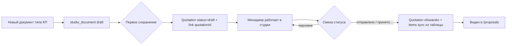

# Doc Studio — дорожная карта v2 (PO decisions 2026-09-02)

> **SoT:** этот файл + `docs/pages/document-studio.page.md`  
> **Очередь:** `tasks/WAVE-DOCSTUDIO-S16-S25.md`  
> **S15–S26 DONE** · wave closeout S26

## Север (PO)

Универсальная студия: шаблон → подставить товары/клиента → PDF.  
**КП в студии = полноценное КП** с жизненным циклом и разделом «КП».  
Один менеджер — один документ. Merge UI — не делаем.

## Решения PO (зафиксировано)

| Тема | Решение |
|------|---------|
| **КП / Quotation** | Работа в студии ведёт к `Quotation`. По умолчанию **черновик**. Смена статуса (на проверке / принято…) → продвижение в жизненном цикле, видно в разделе КП |
| **Сохранение** | Как в нормальных приложениях: **Сохранить** (документ) + **Сохранить как…** → «Шаблон» (позже — другие форматы). Шаблон: перезапись если имя существует |
| **Удаление** | Документы и шаблоны можно удалять (сейчас в picker шаблонов удаления нет — мусор копится) |
| **Rails** | Лево = данные, право = макет. **Отдельный toggle режима не нужен** — проще и меньше кода |
| **КП/заказ в «Данные»** | Оставить как альтернативу витрине. **Редактирование существующего** — открыть документ/КП целиком; не дублировать «подтянуть» в новом документе |
| **Формулы** | Первая рабочая версия = частые Excel-операции (сумма, %, НДС). **Ставка НДС** — из реестра/справочника, не захардкожена |
| **Реестры** | Группировка по категориям с заголовками — отдельный polish |

## Целевая IA

```
LEFT (данные)          CENTER              RIGHT (макет)
─────────────          ──────              ─────────────
Данные                 A4                  Элементы
  витрина                                    Слои
  контрагенты                                Страницы
  КП / заказ (alt)                           Свойства
                                             Шаблон / Сохранить как…

Ribbon: [имя] · Сохранить ▾ · К списку · Редактор · Просмотр · PDF · Архив · [статус КП]
```

**Почему без toggle:** оператор сам выбирает rail. Лево = «что подставить», право = «как выглядит». Меньше состояний, тот же результат.

## Жизненный цикл КП (техническое решение)



- **Открыть существующее КП:** из раздела КП → «В студии» → `context` уже с `quotationId`, строки из КП.
- **Новое КП:** пустой документ или из шаблона → витрина → при save создаётся draft Quotation.
- Синхронизация items: catalog/таблица студии → `Quotation.items` при save и при смене статуса.

## Волны

| # | TZ | Суть |
|---|-----|------|
| S15 | DATA-VITRINA-UNIFIED | **DONE** |
| S16 | RAIL-IA-SPLIT | Лево=Данные, право=макет |
| S17 | RIBBON-PAGES-PANEL | Ribbon чистый + панель «Страницы» |
| S17A | TABLE-TEMPLATE-COLUMN-LOCK | Колонки read-only при виде из реестра |
| S18 | SAVE-AS-MENU | Сохранить / Сохранить как → шаблон + overwrite |
| S19 | STUDIO-DELETE | Удаление документов и шаблонов |
| S20 | KP-QUOTATION-LIFECYCLE | Draft Quotation, статус, sync, вход из /proposals |
| S21 | TABLE-AGGREGATE-TOKENS | Итого/НДС в тексте из таблицы |
| S22 | REGISTRY-VAT-RATE | Ставка НДС в реестре (SoT для формул и таблиц) |
| S23 | FORMULA-REGISTRY | Реестр формул (сумма, %, НДС от S22) |
| S24 | FORMULA-TEXT-BINDING | Формула в текстовом блоке |
| S25 | REGISTRIES-CATEGORY-UI | Категории с заголовками в /registries |
| S26 | OPERATOR-DOCS-V3 | Closeout |

## PARK

- Three-way merge
- «Сохранить как» в PDF/Word (модули позже)
- Excel-конструктор формул

## Термины (для PO)

| Жаргон | По-русски |
|--------|-----------|
| MVP | **Первая рабочая версия** — минимум, но уже можно пользоваться каждый день |
| Quotation | Сущность **КП** в базе (раздел «КП» в меню) |
| studio_document | Черновик/рабочий файл в студии (может быть связан с КП) |
