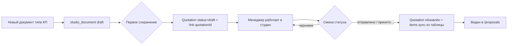

# Doc Studio — дорожная карта v2 (PO decisions 2026-09-02)

> **SoT:** этот файл + `docs/pages/document-studio.page.md`  
> **Очередь FINISH:** `tasks/_ready/docstudio-finish/INDEX.md` · `WAVE-DOCSTUDIO-FINISH-S27.md`  
> **FINISH S27–S35, S38–S40 — DONE** (архивы в `tasks/_archive/2026-09/`). S36 (этот файл) — в работе, S37 (operator smoke) — последний, ещё не запущен.  
> Honesty audit: `docs/audits/2026-09-03-docstudio-honesty-audit.md` (дыры S27–S40 закрыты кодом; S15 `FALSE_DONE` — fixed-by S27–S29)

## Север (PO)

Универсальная студия: шаблон → подставить товары/клиента → PDF.  
**КП в студии = полноценное КП** с жизненным циклом и разделом «КП».  
Один менеджер — один документ. Merge UI — не делаем.

## Решения PO (зафиксировано)

| Тема | Решение |
|------|---------|
| **КП / Quotation** | Работа в студии ведёт к `Quotation`. По умолчанию **черновик**. Смена статуса (на проверке / принято…) → продвижение в жизненном цикле, видно в разделе КП |
| **Сохранение** | Как в нормальных приложениях: **Сохранить** (документ) + **Сохранить как…** → «Шаблон» (позже — другие форматы). Шаблон: перезапись если имя существует |
| **Удаление** | Документы и шаблоны можно удалять (сейчас в picker шаблонов удаления нет — мусор копится) |
| **Rails** | Лево = данные, право = макет. **Отдельный toggle режима не нужен** — проще и меньше кода |
| **КП/заказ в «Данные»** | Оставить как альтернативу витрине. **Редактирование существующего** — открыть документ/КП целиком; не дублировать «подтянуть» в новом документе |
| **Формулы** | Первая рабочая версия = частые Excel-операции (сумма, %, НДС). **Ставка НДС** — из реестра/справочника, не захардкожена |
| **Реестры** | Группировка по категориям с заголовками — отдельный polish |

## Целевая IA

```
LEFT (данные)          CENTER              RIGHT (макет)
─────────────          ──────              ─────────────
Данные                 A4                  Элементы
  витрина                                    Слои
  контрагенты                                Страницы
  КП / заказ (alt)                           Свойства
                                             Шаблон / Сохранить как…

Ribbon: [имя] · Сохранить ▾ · К списку · Редактор · Просмотр · PDF · Архив · [статус КП]
```

**Почему без toggle:** оператор сам выбирает rail. Лево = «что подставить», право = «как выглядит». Меньше состояний, тот же результат.

## Жизненный цикл КП (техническое решение)



- **Открыть существующее КП:** из раздела КП → «В студии» → `context` уже с `quotationId`, строки из КП.
- **Новое КП:** пустой документ или из шаблона → витрина → при save создаётся draft Quotation.
- Синхронизация items: catalog/таблица студии → `Quotation.items` при save и при смене статуса.

## Волны (история S15–S26)

| # | TZ | Суть / честность 2026-09-03 |
|---|-----|------|
| S15 | DATA-VITRINA-UNIFIED | **FALSE_DONE** (UI срезан) → **fixed-by S27 (витрина в Данные), S28 (backend hydrate), S29 (FE live rows)** |
| S16 | RAIL-IA-SPLIT | DONE |
| S17 | RIBBON-PAGES-PANEL | DONE |
| S17A | TABLE-TEMPLATE-COLUMN-LOCK | DONE* |
| S18 | SAVE-AS-MENU | DONE (Save-as); ribbon «Сохранить» fake → S30 |
| S19 | STUDIO-DELETE | DONE |
| S20 | KP-QUOTATION-LIFECYCLE | PARTIAL → усиление S33 |
| S21–S24 | tokens / VAT / formulas | DONE* (S34 dedup UI) |
| S25 | REGISTRIES-CATEGORY-UI | DONE elsewhere |
| S26 | OPERATOR-DOCS-V3 | FALSE docs → S36 |

## FINISH S27–S40 — DONE (S37 last, pending)

Pack `tasks/_ready/docstudio-finish/`. S27–S35, S38, S39, S40 archived в `tasks/_archive/2026-09/`.
S36 (docs truth) — эта TZ. S37 (operator smoke) — последний, запускается после S36.
Operator completeness: `docs/architecture/nx-doc-studio-operator-bar.md` (S27–S40; smoke S37 last).

## PARK

- Three-way merge
- «Сохранить как» в PDF/Word (модули позже)
- Excel-конструктор формул

## Термины (для PO)

| Жаргон | По-русски |
|--------|-----------|
| MVP | **Первая рабочая версия** — минимум, но уже можно пользоваться каждый день |
| Quotation | Сущность **КП** в базе (раздел «КП» в меню) |
| studio_document | Черновик/рабочий файл в студии (может быть связан с КП) |
