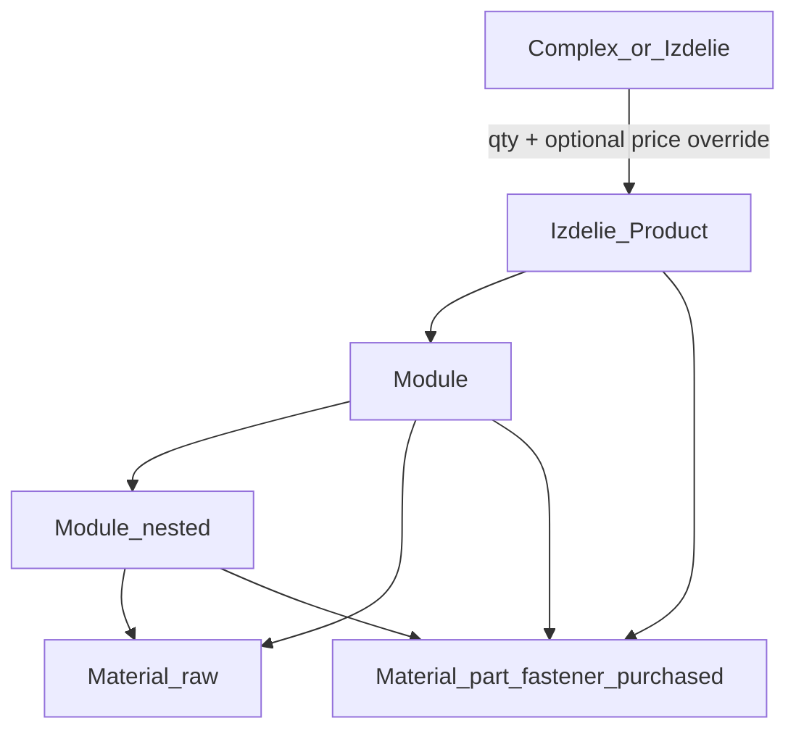

# CATALOG composition vision — Материалы / Детали / Модули / Изделия / Комплексы

> **Статус (peer-handoff):** файл восстановлен 2026-08-04 для передачи peer + фиксации LOCKED D1–D4.  
> **Код в рамках этого плана не писать** — только после явного «стартуем» от PO.  
> **Автор канона:** Cursor (Mode A) по устным уточнениям PO + аудиту Excel.  
> **Excel-образец:** `tasks/Данные/6104 test Tigran с картинками.xlsx` (пример структуры, **не** обязательно одно изделие).
>
> **После peer:** замечания впитаны в [`tasks/TZ-CATALOG-300.md`](../../../tasks/TZ-CATALOG-300.md) (CANON).  
> Имя поля в каноне: **`materialKind`** (в этом draft исторически `componentKind` — то же решение **D3**).  
> Нумерация child-TZ: только **TZ-CATALOG-300…331** (не плодить `TZ-GPT-CATALOG-*` в `tasks/`).

Связанные файлы:

- Peer-plan: `.cursor/plans/catalog_peer_critique_*.plan.md` (не править plan-файл)
- Канон после peer: `tasks/TZ-CATALOG-300.md`
- Канон PO: `docs/PO-DIARY.md`
- Модель: `docs/data-model.md`

---

## 0. Решения, уже утверждённые для peer-аудита (F1–F4)

| # | Вопрос | Решение PO/Cursor |
|---|--------|-------------------|
| F1 | Nested module embed vs refs | **B: refs + qty** — composition-строки на родителе ссылаются на общие Module/Material/Product; **не** deep-clone дерева |
| F2 | 125 PNG из xlsx | Извлечь media → upload через Photo API → attach; batch + progress; не blob в Mongo |
| F3 | Cycle/Depth Phase 1 | **Да:** циклы запрещены (400); лимит глубины — см. **§0.1 D4** |
| F4 | Где TZ | Master + wave1 в `tasks/`; хвост в `tasks/_backlog/catalog/` |

### 0.1 Четыре решения для критики peer (LOCKED PO/Cursor 2026-08-04)

Передай peer именно этот файл. Попроси **confirm / challenge** по пунктам:

| ID | Решение | Вердикт | Почему |
|----|---------|---------|--------|
| **D1** | Разрешать **Product → Product** (комплекс) | **ДА** | Площадка / набор тренажёров: qty + опц. цена линии; остальное наследуется с изделия-ref |
| **D2** | Запрещать **Product → raw Material** | **ДА** | Сырьё только через модуль (PO). На изделие можно класть модули, детали (не-сырьё), другие изделия |
| **D3** | Детали / метизы / покупные **внутри Material** через `componentKind` / канон **`materialKind`** | **ДА в Phase 1** | Одна коллекция + склад `StorageItem.materialId` без новой сущности. UI-вкладки «Материалы» / «Детали» = фильтр. Отдельный `Part` — только если Phase 1 вскроет боль |
| **D4** | Лимит глубины **8** | **ДА hard max = 8** | Excel ≤3; цеху хватит с запасом. UI: warn/collapse после 5, hard fail на 9-м уровне. Циклы всё равно запрещены |

`componentKind` (предложение enum на Material):

- `raw` — сырьё (лист, труба, дерево…) — **только в Module**
- `part` — деталь/заготовка с сортаментом (часто Excel «Деталь»)
- `fastener` — метиз
- `purchased` — покупное изделие

Composition lineType Phase 1: `module | material | product`  
(детали = material с kind ≠ raw; на Product запрещён только `componentKind=raw`).

---

## 1. Глоссарий (как говорит цех / PO)

| Термин UI (RU) | Смысл | Код / коллекция (Phase 1) |
|----------------|--------|----------------------------|
| **Материал** | Сырьё | `Material` + `componentKind=raw` |
| **Деталь / Метиз / Покупное** | Каталожные не-сырьевые позиции | Тот же `Material` + `componentKind=part\|fastener\|purchased`; отдельные пункты меню = фильтр |
| **Модуль** | Сборочный узел | `ProductModule` |
| **Изделие** | Продаваемая единица | `Product` (UI-лейбл «Изделие») |
| **Комплекс** | Несколько изделий | `Product` с product-lines и/или `kind=complex` |

**Важно (PO 2026-08-04):** Excel могли дать «что было под рукой» — там несколько корней / позиций; `14` = модуль, `14.1` = подмодуль. Не трактовать файл как обязательный single-product.

---

## 2. Правила состава (канон)



### Разрешено

| Родитель | Может содержать | Поля на связи |
|----------|-----------------|---------------|
| **Комплекс / Изделие** | Изделия, Модули, Material с `componentKind≠raw` | `quantity`; для product-line — опц. **override price** |
| **Модуль** | Модули, Material (любой kind, в т.ч. raw) | `quantity`; override dimensions для raw/part |
| **Material** | — (лист) | — |

### Запрещено

| Связь | Почему |
|-------|--------|
| **Изделие → Material(raw)** | Сырьё только через модуль (**D2**) |
| Циклы A⊃B⊃A | Guard Phase 1 |
| Глубина > **8** | Hard max (**D4**); UI warn после 5 |

### Наследование в комплексе

Когда в комплекс кладут изделие:

- **Наследуется (read-only rollup / ссылки):** состав модулей, цвет/RAL, габариты, фото галереи изделия, описание…
- **Задаётся на связи комплекса:** `quantity`, опционально `unitPrice` / `linePrice` (скидка комплекса)
- **Не копировать** дерево изделия внутрь комплекса — только ref + qty (+ price override)

---

## 3. Маппинг Excel «Вид изделия» → сущности

| Excel | → сущность | Комментарий |
|-------|------------|-------------|
| Модуль | Module | В т.ч. вложенный (`11.1`) |
| Деталь | чаще **Material raw** (есть сортамент/ГОСТ + марка) **или** Part — эвристика импорта: если заполнены Сортамент/ГОСТ → Material; если Покупное → Part |
| Метиз | Part или Material(`fastener`) | Предложение: **Part** (крепеж покупной) |
| Покупное изделие | **Part** | Поставщик + цена |
| Корень файла / несколько деревьев | 1+ **Изделие** при импорте (группировка по эвристике или ручной выбор в визарде) |

Колонки Excel (аудит): Позиция, Обозначение, Длина, Ширина, Толщина, Масса, Сортамент/ГОСТ, Материал (марка), Вид изделия, К-во (+ ~125 PNG).

---

## 4. Модель composition (технический канон)

**Строка состава** (embedded на родителе, **refs** на каталог):

```ts
{
  lineType: 'module' | 'material' | 'product', // product только на Product
  refId: ObjectId,
  quantity: number,
  sortOrder: number,
  unitPrice?: number,          // override для complex→product
  overrideDimensions?: {...},  // material lines
}
```

- Module.composition: `module | material`
- Product.composition: `module | material(non-raw) | product`
- Заменить сегодняшние `Product.productModuleIds[]` (без qty) и `ProductModule.materials[]`

API дерева: `GET /modules/:id/tree?maxDepth=8`, аналогично product; lazy UI expand; warn UX >5.

---

## 5. UI «идеал» (кратко для peer)

- Один UI-kit: диалоги как Material form (content / ~1000px / sticky footer)
- Карточки: `/materials/:id` (фильтр kind), `/modules/:id`, `/products/:id`
- Состав: `CompositionEditor` + tree-table; клик раскрывает детей
- Комплекс: Product UI + бейдж; product-lines с qty/price
- Именование в UI: **Изделие**; Комплекс — kind/бейдж

---

## 6. Волны TZ

Канон нумерации проекта: **TZ-CATALOG-300…331** (этот репо).  
Если peer предлагает **TZ-GPT-CATALOG-301…313** — считать **черновиком маппинга**, свести в 300-серию при активации (не плодить два кластера в `tasks/`).

| Кластер | Содержание (сводка) |
|---------|---------------------|
| 300 | Master + AC + этот vision |
| 301 | Material: assortment/gost/grade + **componentKind** |
| 302 | Composition refs Module+Product (+ product→product); migrate productModuleIds/materials[] |
| 303 | Cycle + depth≤8 guards + tree API |
| 304 | Attachments (docs) |
| 310–314 | UI kit, cards, tree-table composition, lists |
| 320–322 | Excel import + photos (multi-root) |
| 330–331 | Stock + docs sync |
| (peer 312–313) | Snapshots / desktop-import — **backlog**, не Phase 1 blocker |

---

## 7. Что peer должен вернуть (критика)

1. Confirm/Challenge **D1–D4** (§0.1) — особенно D3 (один Material) и D4 (depth 8).  
2. Conflict keys Wave 1 (schema/DTO/FE forms).  
3. Риски product→product для цен/себестоимости.  
4. Нужен ли `kind=complex` явный или достаточно «есть product-lines».  
5. **Не** расширять People/КП/Gantt; snapshots/desktop-import оставить backlog.

---

## 8. Текст-сопроводиловка для второго ИИ (скопировать)

```
Прочитай docs/compose/plans/2026-08-04-catalog-composition-vision.md целиком.
Это канон обсуждения каталога kppdf (не код).

Прокритикуй особенно четыре LOCKED решения §0.1:
D1 Product→Product = YES (комплекс)
D2 Product→raw Material = FORBIDDEN
D3 Детали/метизы/покупные = Material.componentKind (не отдельная Part) в Phase 1
D4 hard depth max = 8 (UI warn >5), cycles forbidden

Верни: agree/disagree по каждому + риски + conflict keys для Wave 1.
Если предлагаешь TZ-GPT-CATALOG-301…313 — дай таблицу маппинга на TZ-CATALOG-300…331.
Не пиши код. Не расширяй scope за пределы каталога.
```

---

*Конец discussion draft. Файл для передачи peer-ИИ.*

---

## 9. Исход peer + gate «стартуем» (закрытие плана peer-critique)

| Шаг плана | Статус |
|-----------|--------|
| **peer-handoff** | Готов: этот файл + §8. Отдать второму ИИ целиком. |
| **await-peer** | **DONE** — GPT peer 2026-08-04 AGREED по D1–D4; правки впитаны в \TZ-CATALOG-300\ (отдельный review-файл не храним). |
| **await-start** | Gate этого плана: код продукта из peer-critique **не** стартуем здесь. Wave 1 — только по «стартуем» / child-TZ из канона 300. |

Snapshots / desktop-import (бывш. peer 312–313) — backlog, не Phase 1 blocker.
