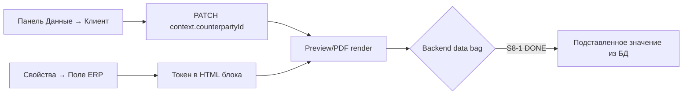
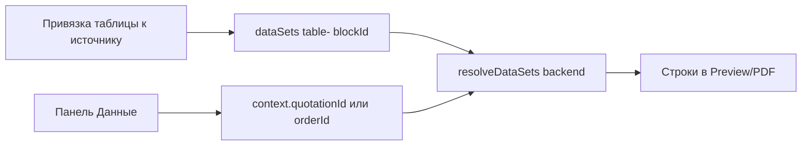

# Страница: Документ-студия (`/studio`)

**Кратко:** единое рабочее место для создания и правки **экземпляров документов** (КП, договор, паспорт, произвольный A4): лист по центру, боковые рельсы с overlay-панелями, слои, таблицы, подстановочные поля, PDF и архив.

**Маршруты NX (актуально):**

| Route | Что видит оператор |
|-------|-------------------|
| `/studio` | Список документов, «Создать документ» |
| `/studio/:id` | Редактор (единственная страница правки — без ухода в builder/texts) |

`pageKey`: `doc-studio` · ADR: [`../architecture/document-studio.md`](../architecture/document-studio.md) · карта переноса: [`../architecture/nx-doc-studio.md`](../architecture/nx-doc-studio.md)

**Статус волны:** S2–S14 **DONE**. S14 добавила поиск/фильтр списка, результат архивации, floating typography panel и подробности конфликтов.

---

## 1. Карта интерфейса

На `/studio` доступны поиск по названию и фильтр по статусу: «Все статусы», «Черновики», «Замороженные», «В архиве». Фильтрация выполняется локально после загрузки списка и не меняет серверный write-path.

### 1.1 Шапка приложения (не студия)

Вкладка **«Докум.»** в app-shell. Общие настройки, тема, пользователь — как на всех страницах.

### 1.2 Ribbon (вторая строка, 36px)

Слева направо — три логические зоны:

| Зона | Элементы | Назначение |
|------|----------|------------|
| **Контекст** | «Студия документов», **+ Страница**, ‹ Стр. N / M ›, **Книжная/Альбомная** | Метка модуля; добавить страницу (`manualPageCount`); навигация по страницам; PATCH `orientation` на документе |
| **Документ** | Badge имени, «Страниц: N» | `doc.name`, `pageCount()` — только информация |
| **Действия** | К списку · **Редактор** · **Просмотр** · Шаблон · PDF · В архив | Навигация, режим, вывод |

**Ribbon — что работает сейчас**

| Кнопка | Поведение |
|--------|-----------|
| К списку | `/studio` |
| Редактор | Canvas: drag/resize, правка текста и таблиц на листе |
| Просмотр | `POST /studio-documents/:id/preview` → iframe с HTML как при печати |
| Шаблон | Диалог save-as-template (нужен `docTypeId`) |
| PDF | `downloadPdf` + сохранение файла |
| В архив | Confirm → finalize (draft→frozen→final), ERP snapshot строк таблицы |

### 1.3 Icon-rail (app-chrome-rail, слева и справа)

Студия регистрирует инструменты через `ShellToolRailService` (owner `studio-editor`).

**Слева:**

| Иконка | Панель | Содержимое |
|--------|--------|------------|
| **Элементы** | Flyout 340px | + Текст, + Фото, + Таблица (новый слой) |
| **Данные** | Flyout | Исполнитель (read-only), селекты **Клиент**, **КП**, **Заказ** → PATCH `document.context` |
| **Шаблон** | Flyout | Тип документа (`docTypeId`), CTA «Сохранить как шаблон» |
| **Слои** | Flyout | Z-order, lock, видимость (глаз), удаление, «Свойства» на плитке |

**Справа:**

| Иконка | Панель | Содержимое |
|--------|--------|------------|
| **Свойства** | Flyout | По типу блока: текст (rich-text, библиотека, **ERP-поле**), таблица (вид/колонки), изображение (фон паспорта), общие действия |

Повторный клик по активной иконке или клик по листу **сворачивает** панель. Лист A4 **не меняет размер** при open/close (закон [`kp-workspace-geometry.md`](./kp-workspace-geometry.md)).

### 1.4 Stage (центр)

- Для каждой страницы можно выбрать отдельный фон из списка; «Нет» отключает фон текущей страницы.
- Для фото в витрине показывается миниатюра первого доступного фото; при ошибке загрузки остаётся безопасный placeholder.

- Белый лист A4 в рамке; все **видимые** слои текущей страницы composited по z-index.
- **Активный слой** — единственный с drag/resize и редактированием ячеек/текста.
- Нижний угол stage: Fit / 100% / метка страницы; Fit использует viewport, 100% — логический A4.

### 1.5 Status-bar (низ)

Текст статуса: «Режим просмотра», autosave, ошибки контекста и т.д.

---

## 2. Подстановочные поля — как это задумано и что работает

### 2.1 Два разных механизма

| Механизм | Где настраивается | Синтаксис | Когда подставляются данные |
|----------|-------------------|-----------|----------------------------|
| **Текстовые токены** | Свойства → текст → «Поле ERP» | `{{source.field}}`, напр. `{{counterparty.name}}` | **Просмотр / PDF / архив** (серверный рендер). В режиме **Редактор** на листе виден **сырой токен**. |
| **Строки таблицы из ERP** | Legacy: rail «Таблица» + `putDataSet`. **NX: UI отсутствует** | dataSet `source.type`: `quotation-items` \| `order-items` | **Просмотр / PDF**, если в документе есть dataSet и в **Данные** выбран КП/заказ. Строки live-read до finalize, потом snapshot. |

Каталог полей для текстовых токенов: `GET /api/registry/data-sources` → диалог «Постановочные данные» (`studio-data-field-picker-dialog`).

### 2.2 Цепочка для текста `{{counterparty.name}}`

**Шаги оператора:**

1. В **Данные** выбрать **Клиент** (Counterparty) — сохраняется в `studio_documents.context.counterpartyId`.
2. В текстовом блоке через **Поле ERP** вставить, например, `{{counterparty.name}}`.
3. Переключить **Просмотр** (или PDF) — сервер подставляет значение из БД.

**S8-1 DONE (2026-08-31):** `StudioOutputService.renderStudioDocument` перед рендером читает `doc.context` (counterpartyId/quotationId/orderId/contractId/contactPersonId/siteId) и строит substitution bag через `DocumentTemplateService.buildSubstitutionBag` (reuse cascade: order→quotation→counterparty и т.д.). Bag прокидывается в рендер через `StudioDocumentAggregate.data` (приоритет над buildDto-stub'ами). Каскад КП/заказ→клиент работает как в legacy. В **Редакторе** токен по-прежнему виден сырым — это норма.

**Исполнитель (наша фирма):** берётся из `document.organizationId` пользователя; в панели «Данные» показывается read-only имя (`issuerOrgName`). Токены `{{organization.*}}` подставляются из того же bag.

**Продукт / каталог:** выбор витрины сохраняется в `context.catalogSelections`; catalog dataSets live-resolve на Preview/PDF.

### 2.3

Свойства таблицы поддерживают источник строк: **Вручную**, **Из КП** (`quotation-items`) и **Из заказа** (`order-items`). Выбор сохраняется через `PUT /studio-documents/:id/data-sets/table-<blockId>` с revision gate; при отсутствии выбранного КП/заказа показывается подсказка в свойствах.
 Цепочка для таблицы из КП/заказа

**Backend готов:** `StudioDataResolverService` читает `quotation-items` / `order-items` по `context` (с org-scope check).

Источник строк таблицы поддерживается в NX: `putDataSet` сохраняет `manual`/КП/заказ/catalog с revision gate; live rows резолвятся на Preview/PDF.

### 2.4 Якоря и связь «Данные» ↔ подстановка

Контекст поддерживает `anchors.client|payer|supplier` в форме `{ entityType, entityId }`. Legacy `counterpartyId` и `anchors.client.entityId` читаются совместно; выбор клиента записывает оба поля, а Preview/PDF принимает токены `{{anchor.client.*}}` с legacy-алиасом `{{counterparty.*}}`. В панели «Данные» выбранные якоря показываются чипами с русскими ролями.

| Поле в «Данные» | Поле в `context` | Влияет на |
|-----------------|------------------|-----------|
| Клиент | `counterpartyId` | Токены `{{counterparty.*}}` (после S8-1) |
| КП | `quotationId` | Строки таблиц с source `quotation-items` |
| Заказ | `orderId` | Строки таблиц с source `order-items` |
| Исполнитель | (из JWT org) | `{{organization.*}}`, scope ERP |

Выбор КП/заказа в NX заполняет клиента автоматически, если клиент ещё пуст; legacy builder сохраняет собственный cascade при render.

---

## 3. Панели — детально

### 3.1 Элементы

- **+ Текст:** в активный текстовый слой или новый текстовый слой.
- **+ Фото:** новый image-слой (upload).
- **+ Таблица:** новый table-слой с дефолтными колонками.

### 3.2 Слои

Список блоков текущей страницы: drag reorder → PATCH z-index; lock; глаз → `isActive`; удаление; переход в Свойства.

### 3.3 Данные

S12: выбор заказа заполняет клиента из `order.counterpartyId`, только если клиент ещё не выбран. Выбранные фоновые изображения и прозрачность сохраняются через revision-gated PATCH документа.

PATCH документа `{ context: { counterpartyId, quotationId, orderId, anchors, catalogSelections } }` с revision gate. Панель содержит селекты Клиент, Плательщик и Поставщик, показывает выбранные якоря и catalog chips с количеством и удалением. Выбор КП/заказа заполняет клиента, если он пуст; удаление chip снимает позиции витрины и синхронизирует таблицы. Списки КП/заказов/контрагентов — live API при открытии редактора.

### 3.4 Шаблон

- **Тип документа** (`docTypeId`) — обязателен для «Сохранить как шаблон» и ribbon «Шаблон».
- Save-as-template: имя + `keepDataBindings` → `POST …/save-as-template`.

### 3.5 Свойства (текст)

- Rich-text (TipTap), шрифт/размер/цвет/выравнивание на уровне блока (`TemplateBlock.style`).
- Библиотека: pick/save → реестр «Тексты».
- **Поле ERP:** вставка токена (см. §2).

### 3.6 Свойства (таблица)

- Выбор **вида таблицы** из реестра «Виды таблиц».
- Редактор колонок (key, label, type, width, align).
- Прозрачный фон таблицы; сохранение вида в реестр.
- Строки редактируются **на листе** (inline cells).

### 3.7 Свойства (изображение)

- Фон паспорта (`settings.overlay`): full-page под блоками, z-order в canvas и preview (S7-6 DONE).

---

## 4. Режимы и вывод

| Режим | Источник картинки |
|-------|-------------------|
| Редактор | `studio-blocks-canvas` — сырые блоки, токены как текст |
| Просмотр | Backend HTML, таблицы через `injectTableContent` + dataSets |
| PDF | Тот же HTML → puppeteer |
| В архив | `bakeSnapshot` dataSets → `generated_documents` |

---

## 5. API (используется NX)

| Endpoint | NX UI |
|----------|-------|
| CRUD `studio-documents` | list + editor |
| blocks CRUD | canvas |
| PATCH context, orientation, docTypeId | Данные, ribbon, Шаблон |
| `POST …/preview` | Просмотр |
| `POST …/pdf` | PDF |
| `POST …/finalize` | В архив |
| `POST …/save-as-template` | Шаблон |
| `POST …/from-template` | **Нет UI на `/studio`** (S8-3) |
| `POST …/duplicate` | **Нет UI на `/studio`** (S8-3) |
| `PUT …/data-sets/:key` | **Нет UI** (S8-2) |
| `GET registry/data-sources` | picker ERP-полей |

---

## 6. Сделано (S2–S7)

- Shell A4, overlay 340px, icon-rail, ribbon (26px controls).
- Элементы, слои, compositing всех видимых слоёв.
- Текст rich + типографика блока + библиотека текстов.
- Таблица: inline edit, виды из реестра, колонки, save template.
- Панель Данные: клиент, КП, заказ → context.
- Picker ERP-полей → токены в текст.
- Doc type picker, save-as-template guard.
- Preview, PDF, finalize (draft only).
- Passport background image layer.
- Реестры текстов/видов таблиц; снос `/constructor`.
- Encoding canon: [`../ENCODING.md`](../ENCODING.md).

---

## 7. Не сделано / PARK

| # | Gap | Влияние на оператора | Статус |
|---|-----|----------------------|--------|
| 1 | Ctrl+Z и conflict merge UI | Нет визуального слияния параллельных правок | PARK / ADR |
| 2 | Ctrl+Z и conflict merge UI | Полноценного визуального слияния параллельных правок нет | PARK / ADR |

## 7.1 S8–S14 — работает

- Текстовые ERP-токены резолвятся на Preview/PDF; сохраняется legacy alias `{{counterparty.*}}`.
- Таблицы поддерживают ручные строки, КП/заказ и четыре catalog source; draft читает live ERP, finalize печёт snapshot.
- `/studio` поддерживает создание из выбранного DocumentTemplate и дублирование.
- Панель «Данные» поддерживает anchors client/payer/supplier, русские chips, каскад КП/заказ → client и catalog chips с удалением.
- Dblclick текстового слоя открывает свойства и фокусирует rich-text редактор; token picker показывает anchor-группы.
- Стили блока (Arial/Calibri/Times, размер и цвет) применяются в Preview/PDF; таблицы показывают subtotal и НДС 20% с исключением отключённых строк.
- Ctrl+Z/Ctrl+Y в активном rich-text редакторе работает только в текущей сессии документа; merge конфликтов остаётся PARK.
- После успешной архивации оператор видит имя результата в toast; конфликт показывает, что именно будет заменено перезагрузкой.
- S14 панель типографики визуально выделена как floating group; настройки таблицы включают формат, ширину, выравнивание и видимость колонок.
- S8/S9/S10/S11/S12/S13 архивы находятся в `tasks/_archive/2026-08/` и `tasks/_archive/2026-09/`.

---

## 8. Типографика (D1)

`TemplateBlock.style` — SoT шрифта/размера/цвета/выравнивания. Inline font-family/size/color вырезаются при save; bold/italic/underline и `{{…}}` сохраняются. Шрифты: Times New Roman, Arial, Calibri (+ metric-compatible в PDF).

---

## 9. Связанные документы

- [`document-studio-data-anchors.md`](../architecture/document-studio-data-anchors.md)
- [`kp-workspace-geometry.md`](./kp-workspace-geometry.md)
- [`../ENCODING.md`](../ENCODING.md)
- Волна S8: [`../../tasks/WAVE-DOCSTUDIO-S8.md`](../../tasks/WAVE-DOCSTUDIO-S8.md)
