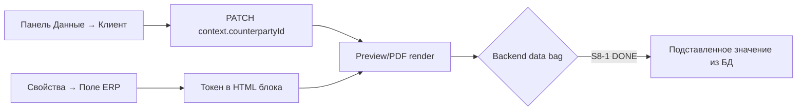
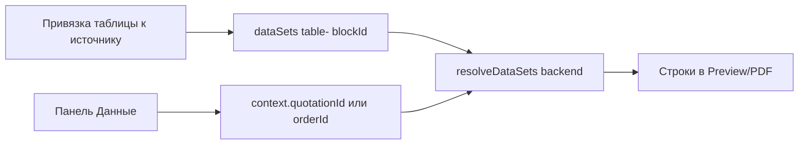

# Страница: Документ-студия (`/studio`)

**Кратко:** единое рабочее место для создания и правки **экземпляров документов** (КП, договор, паспорт, произвольный A4): лист по центру, боковые рельсы с overlay-панелями, слои, таблицы, подстановочные поля, PDF и архив. **NX P4 polish:** карточки витрины в панели «Данные» переносят длинные названия максимум на две строки и не создают горизонтальный скролл.

**Имена для PO:** вкладка **«Докум.»** = модуль **Документ-студия** (`/studio`). Левый rail: **«Данные»** (широкая панель ERP-контекста) и **«Выбрано»** (буфер с badge). IA-реформа панели: [`../audits/2026-09-05-docstudio-data-panel-ia-audit.md`](../audits/2026-09-05-docstudio-data-panel-ia-audit.md) · WAVE `WAVE-DOCSTUDIO-DATA-IA.md`.

**Маршруты NX (актуально → цель WAVE-DOCSTUDIO-CHROME-IA):**

| Route | Что видит оператор |
|-------|-------------------|
| `/studio` | **Документы** — список экземпляров (после C1: **без** auto-resume в редактор) |
| `/studio/templates` | **Шаблоны** — список `document_templates` (C2) |
| `/studio/:id` | **Студия** — редактор; шапка = только крошки; Save/PDF/режим/архив → правый chrome-rail (C3) |

Аудит шапки: [`../audits/2026-09-06-docstudio-chrome-ia-audit.md`](../audits/2026-09-06-docstudio-chrome-ia-audit.md) · WAVE `WAVE-DOCSTUDIO-CHROME-IA.md`.

**CTA на `/studio` (`TZ-NX-DOCSTUDIO-LIST-DROP-NEW-KP`, 2026-09-12):** **Шаблоны** | **Из шаблона** | **Создать документ** — без отдельной «Новое КП» (была не по логике универсальных документов). КП создаётся из **Сделки → КП** («Создать в студии», `/proposals`, тот же `findKpDocType` helper) или позже из явно сохранённого шаблона «КП» через «Из шаблона».

**NX UX sweep (2026-09-09, `TZ-NX-UX-15-studio-list-FIX`) — `/studio` и `/studio/templates` списки
(A4-редактор `/studio/:id` НЕ затронут):** строка документа в `/studio` теперь показывает RU-метку
статуса («Черновик»/«Заморожен»/«В архиве») вместо сырого английского значения (`document.status`
раньше рендерился как есть — «draft» вместо «Черновик»). Кнопка «×» удаления на обеих страницах
(`/studio` и `/studio/templates`) переведена с мёртвого `class="pi-icon-button"` (нет CSS, тот же
класс мёртвых кнопок, что и `pi-button-*` из `08b`) на реальный `.pi-icon-btn .pi-icon-btn-danger`.
Третье место с тем же мёртвым классом, `studio-template-picker-dialog.component.ts` (модалка
«Выберите шаблон»), было вне glob'а этого TZ (`studio-*.page.ts`) — закрыто отдельным
`TZ-NX-STUDIO-TEMPLATE-PICKER-ICONS` (2026-09-11): та же замена на `.pi-icon-btn .pi-icon-btn-danger`.
`rg pi-icon-button frontend-nx` → 0 hits, мёртвого класса в репо больше нет. См.
`docs/audits/2026-09-09-nx-ux-studio-list-audit.md`.

**Live-данные таблиц (S46):** строки таблиц с живым источником (`catalog-*`, ERP) живут в клиенте (`settings.liveRows`, ephemeral — **не** пишутся в Mongo); после сохранения layout (drag/resize) клиентские строки восстанавливаются merge'ем ответа API с локальным блоком, иначе — one-shot re-hydrate через `putDataSet`. Аудит: [`../audits/2026-09-06-docstudio-live-data-hydrate-audit.md`](../audits/2026-09-06-docstudio-live-data-hydrate-audit.md).

**Serial hydrate on load (`TZ-NX-DOCSTUDIO-CATALOG-HYDRATE-ALL`, 2026-09-12):** GET на open **не** несёт `liveRows` — `refreshLiveDataSetsOnLoad` re-put'ит каждую wired-таблицу через общую `hydrateTablesSerially` очередь, **последовательно** (await на каждой, следующая читает revision, которую вернула предыдущая), а не параллельно; при 2+ живых таблицах на документе (типично: изделия+модули+детали+материалы) параллельный fire-and-forget бил все N запросов одной и той же revision → сервер 409-ил все кроме первой и они молча оставались пустыми. Тот же helper (`refreshCatalogTablesOfKind`) используют повторный Insert (D52) и Save в витрине (кнопка «Изменить»).

**Один write-queue на документ (`TZ-NX-DOCSTUDIO-ADD-PAGE-WRITE-SERIAL`, 2026-09-13):** «+ Страница», ориентация, фон и нумерация страниц раньше писали `expectedRevision` мимо очереди выше — гонка с hydrate-on-load (который тоже раньше был вне очереди) 409-ила один из двух, а повторный конфликт при уже открытом диалоге был тихим no-op («кнопка не работает»). Теперь все пять — в одной очереди (`catalogWriteChain`, имя оставлено, роль расширена), сам hydrate-on-load синхронно встаёт в неё же при загрузке; повторный конфликт при открытом диалоге — toast один раз, не тишина. Create table/text/image и layout-save больше не гадают локальным `revision + 1` (эти эндпоинты возвращают только блоки, не документ) — подтверждают ревизию follow-up `getById`.

**Привязка колонок таблицы (S47):** ячейка = `column.key`, **не** позиция в строке — `COLUMN_ALIASES`/`lineValue` в `studio-data-resolver.ts` знают `sku`/`article`, `photo`, `productName`/`name`, `description`, `unit`, `unitPrice`/`price`, `sum`/`total`/`amount` (parity с Create КП `proposal-table-layout.util.ts`). Канон 6 колонок КП (скрин PO): **Артикул | Фото | Наименование | Описание | Ед.Изм. | Цена** — любой порядок ключей работает, дубликаты по алиасу не бывает. Смена «Вид таблицы» **или** структуры колонок (add/remove/rename-key) на таблице с живым источником обязана заново дёрнуть `putDataSet` с пустыми `rows` (`rehydrateLiveRowsAfterColumnChange` в `studio-editor.page.ts`) — иначе `liveRows`, посчитанные под старое число колонок, остаются и съезжают под новые заголовки (было: 3 ячейки под 6 заголовками). Скрытые колонки (`tableHiddenColumnKeys`) фильтруются одинаково что для ручных, что для live-строк (`studioVisibleColumnIndices`) — раньше live-таблицы игнорировали hide. **Known limitation:** в `TableTemplate` пока нет seed-пресета с ключами PO-канона (есть только `КП — позиции`, другой набор колонок) — оператор создаёт вид таблицы вручную через «Свойства → Сохранить как шаблон», ре-хайдрейт после выбора уже корректен. Аудиты: [`../audits/2026-09-08-docstudio-table-field-binding-audit.md`](../audits/2026-09-08-docstudio-table-field-binding-audit.md), [`../audits/2026-09-08-docstudio-table-field-binding-audit-claude-recheck.md`](../audits/2026-09-08-docstudio-table-field-binding-audit-claude-recheck.md).

**Цена из каталога + «Сумма» (`TZ-NX-DOCSTUDIO-TABLE-PRICE-SUM`, 2026-09-13):** PO-скрин — пустая «Цена» + вторая «Цена» с `0` вместо суммы. Причина: `COLUMN_ALIASES.price` не знал ключи, которые реально хранит каталог/шаблон (`listPrice`/`basePrice`/`pricePerUnit` и `_`-варианты) — теперь знает (BE `studio-data-resolver.ts` + FE `STUDIO_STANDARD_COLUMN_ALIASES` в `studio-table-defaults.ts`, полный parity). `sum = price × qty` (уже считалось резолвером — не хватало только alias-биндинга и UI). **Modules без цены:** `ProductModule` не имеет ценового поля — price/sum остаются `0`, это документированный known_limitation, а не баг (добавлять поле модулям — вне TZ). **Heal лейблов:** при quick-add / любой правке структуры колонок (`healStudioTableColumns`, choke point — `emitColumnStructure` в `studio-table-properties.component.ts`, тот же путь, что S47's rehydrate) пустой или дублирующий «Цена» лейбл на price-ключе нормализуется в «Цена», на sum-ключе — в «Сумма» (фикс исходного PO-скрина: две колонки «Цена», вторая на деле sum). Деliberate кастомный лейбл оператора не трогается. **Type-select необязателен для типовых ключей:** `lineValue`/backend никогда не читают `column.type` — select теперь `disabled` для распознанных ключей (name/qty/price/sum/unit/sku/photo/description), тип выставляется каноном автоматически (qty→number, price/sum→currency, остальное→text); select остаётся живым только для произвольной ручной «+ Колонка», с подсказкой в `title`, что тип не влияет на подстановку.

**Фото в ячейке таблицы (S48):** колонка с ключом-алиасом `photo` (тот же список, что в S47: `photo`/`image`/`рисунок`/`photourl`/`photoid`/`photo_id`/`photoids`/`photo_ids`/`фото`) рендерится как `` при непустом значении ячейки или честное «Нет фото», а не сырой текст/qty — на холсте (`studio-blocks-canvas.component.ts` `isPhotoColumnAt`) и в backend preview/PDF (`studio-data-resolver.ts` `renderPhotoCellHtml`, класс `pi-photo-empty` как в legacy `table-template.service.ts`, без переписывания Create КП). Определение колонки — только по `column.key` (тип колонки `photo`/`image` в NX-схеме `StudioTableColumn` пока не существует, добавлять не требовалось — все сценарии PO-канона используют ключ).

**Авто-heal устаревших `liveRows` при открытии (TZ-NX-DOCSTUDIO-STALE-LIVEROWS-HEAL):** S47's `rehydrateLiveRowsAfterColumnChange` выше форсирует чистый re-fetch, но раньше делал это ТОЛЬКО в момент редактирования структуры колонок оператором — документ, у которого рассинхрон уже случился РАНЬШЕ (до S47/LINE-QTY), оставался кривым до ручного «тронь колонки», пока PO его не открывал. `healStaleLiveRowsOnLoad()` в `studio-editor.page.ts` теперь детектит рассинхрон (`studioLiveRowsMismatchColumns()` в `studio-table-defaults.ts`: сравнивает длину каждой `liveRows`-строки с текущим `settings.tableTemplateColumns`) на КАЖДОЙ загрузке документа, для двух форм: таблица с живым `dataSource` → тот же nuclear-рехайдрейт, что и S47 (override'ы `tableQtyOverrides` переприменяются backend'ом как обычно); таблица БЕЗ `dataSource` (manual, или осиротевшая — как в реальном найденном документе, где `dataSource` не выставлен вовсе) → просто чистит стейл `liveRows` (`liveRows: null`), холст откатывается на `tableTemplateSampleRows`. Причина двух форм: canvas (`studio-blocks-canvas.component.ts` `tableRows()`) рендерит любой непустой `liveRows` БЕЗ проверки `dataSource` — осиротевший снимок съезжает на холсте независимо от того, живая таблица или ручная. PO не обязан пересохранять/трогать таблицу руками — heal срабатывает один раз само при открытии.

**Битая иконка фото → «Нет фото» (TZ-NX-DOCSTUDIO-TABLE-PHOTO-BROKEN-IMG, 2026-09-13):** два независимых фикса на канвасе/resolver'е, не меняют S48-контракт выше. (1) `studio-data-resolver.ts`'s file-existence check (`localUploadFileExists`, из TABLE-PHOTO-SMOKE) и `document-render.utils.ts`'s PDF-инлайнер раньше хардкодили `process.cwd()/uploads` независимо от write-пути (`UPLOAD_DIR` env, `photos/image-upload.options.ts`) — на этом деплое совпадало случайно (UPLOAD_DIR нигде не задан), но было двумя параллельными копиями одного допущения; теперь оба используют общий `resolveUploadsRoot()`. (2) Канвас (`studio-blocks-canvas.component.ts`) теперь ловит `(error)` на `` фото-ячейки и откатывается на то же «Нет фото» — URL, валидный на момент resolve, но не загрузившийся в браузере (аплоад в процессе, рестарт dev-сервера), больше не остаётся сырой битой иконкой навсегда. **Не относится к этой правке:** живой прогон нашёл ту же класс-проблему (orphan Photo без file-check) в панели «Товары» (`pi-studio-data-vitrina`/`app-pi-showcase-card`, client-side, свой code path) — 22 из 23 миниатюр битые в тестовом документе; вне conflict keys этой TZ, successor: `tasks/_ready/TZ-NX-DOCSTUDIO-VITRINA-PHOTO-BROKEN-IMG.md`.

**Витрина «Товары/Модули/Материалы» — та же битая иконка, закрыта (`TZ-NX-DOCSTUDIO-VITRINA-PHOTO-BROKEN-IMG`, 2026-09-13):** successor выше решён backend-стороной — `document-render.utils.ts` теперь экспортирует публичные `localUploadFileExists`/`blankMissingUploadUrls` (вынесены из бывшего private-метода `studio-data-resolver.ts`, третьей копии той же логики не создано); `product.service.ts`/`material.service.ts` `findAll()` применяют их к populated `photoIds`/`mainPhotoId` — orphan-ссылка гасится в пустую строку до ответа API, тем же путём, что и table-резолвер. Живой прогон после фикса: 0 битых `` (было 21/22), 0 сетевых 404 на `/uploads/*` (было 34+), на всех четырёх вкладках витрины (Товары/Модули/Детали/Материалы), рабочая миниатюра рендерится без регресса. Клиентский fallback (`pi-showcase-card`'s `mediaBroken`/`(error)`, уже существовал для `size="sm"`) не трогали — живой Playwright-прогон (`scrollIntoViewIfNeeded` на каждый ``, снимает `loading="lazy"` gate) подтвердил, что он и так корректно срабатывает, просто отложенно до реального intersection; backend-фикс делает эту задержку не наблюдаемой на практике (`mediaUrl` пустой с самого начала). Отдельно подтверждено и НЕ починено в этой TZ (другой класс дефекта, вне scope): `product-module.service.ts findAll()` вообще не популейтит `photoIds`/`mainPhotoId` модулей — вкладка «Модули» всегда показывает плейсхолдер независимо от наличия фото.

**Necessity cleanup таблиц (`TZ-NX-DOCSTUDIO-TABLE-NECESSITY-CLEANUP`, 2026-09-13, этап A — IA):** Один happy path: Выбрано → «Вставить таблицу {kind}» → одна живая таблица на листе → колонки канона из реестра видов → правки карточки обновляют строки → Просмотр/PDF то же. В Свойствах убраны две ложные «дубли»-развилки:
- **«Вид таблицы» → «Макет колонок»** (переименование, тот же select) — при пустом макете на catalog-таблице показывается CTA «выберите вид выше или создайте его в реестре» вместо тихого хардкода 3 колонок.
- **«Источник строк»** для уже-Insert'нутой catalog-таблицы больше не голый enum-дубль кнопки Insert — статус «Строки: {Изделия|Модули|…} из Выбрано (N)» + **[Обновить строки]** (тот же queued heal, что у Insert/VITRINA-EDIT) + **[Сменить…]** (двухшаговый жест раскрывает тот же select — явное намерение вместо случайного клика, без нового модалa). Для `manual`/КП/заказа — как раньше, сразу полный select (единственный путь туда).

**Этап B — Insert→реестр + round-trip источника (2026-09-13):** Insert теперь ищет активный `TableTemplate` реестра по `dataSource` этого catalog-kind и применяет его колонки вместо тихого хардкода `STUDIO_DEFAULT_TABLE_COLUMNS` (3 колонки); нет подходящего вида — toast к «Реестры → Виды таблиц», источник всё равно подключается. Сопоставление нормализует обе стороны (убирает префикс `catalog-` и хвостовое `s`) — живая проверка Mongo нашла реальный вид «Продукты» с `dataSource: "product"` (без префикса, в единственном числе), строгое сравнение никогда бы не сработало. `onTableSourceChange`/бывший `setBlockCatalogSource` слиты в один `applyTableSource`, в общей write-очереди (`catalogWriteChain`): переключение на `manual` явно чистит `liveRows` в `null` (не оставляет пустой массив, который канвас держал бы вечно); `dataSource` теперь пишется и на сам блок (`blocksService.update`), не только в локальный signal — раньше блок и `dataSets` документа могли разойтись после F5; переключение на catalog-вид с пустым «Выбрано» — честный toast.error, не «успех» с нулём строк.

**Этап C — ширина колонок реально влияет на таблицу (`TZ-NX-DOCSTUDIO-TABLE-COL-WIDTH-APPLY`, поглощён этой TZ, 2026-09-13):** поле «Ширина, %» у колонки раньше сохранялось, но нигде не читалось — и на холсте, и в Просмотре/PDF колонки всегда делились поровну; мёртвый control. Теперь `columnWidthPercents()` (общий контракт BE `studio-data-resolver.ts` / FE `studio-table-defaults.ts`) реально применяется к `th`/`td` в обоих местах: без явных значений — прежнее равное деление (без изменений для тех, кто это поле не трогал), с явными — пропорционально к 100%. `necessity-wave` чекаут «≤1 активный вид на канон. имя/dataSource» — подтверждён живой проверкой Mongo (2 активных, без дублей).

Wave 2 (`TZ-NX-DOCSTUDIO-TABLE-NECESSITY-CLEANUP`, этапы A→B→C) закрыта — все три этапа DONE, детали в `docs/agent-checklists/TZ-NX-DOCSTUDIO-TABLE-NECESSITY-CLEANUP.md` + `evidence/`.

**Таблицы на холсте (S45):** холст — print-like: клик по таблице = **выделение** + авто-открытие панели **«Свойства»** справа; на листе — только preview-таблица (никаких inline-редакторов). Редактирование строк (Вкл / ячейки / × / **+ Строка**) — только в «Свойствах», секция «Строки таблицы»; пустая таблица показывает строку-подсказку, а не голый thead — текст зависит от источника (`TZ-NX-DOCSTUDIO-TABLE-UNWIRED-EMPTY-STATE`, `studioTableEmptyStateLabel` в `studio-table-defaults.ts`): без `dataSource` (ручная/только вставленная «+ Таблица») → «Нет источника строк — в Свойствах выберите витрину или нажмите «Вставить таблицу» в Выбрано»; wired catalog/КП/заказ с пустыми строками (например, после сбойного hydrate) → «Нет строк из источника — проверьте Выбрано / КП / заказ», без упоминания «Свойств» (там нельзя вручную добавить строку живого источника). ERP-токены (`{{…}}`) имеют гарантированный зазор справа — текст после чипа не прилипает. Аудит: [`../audits/2026-09-06-docstudio-table-select-vs-properties-audit.md`](../audits/2026-09-06-docstudio-table-select-vs-properties-audit.md).

**Архив документа — Pi dialog, не native confirm (2026-09-11):** `onFinalize()` в `studio-editor.page.ts` больше не зовёт браузерный confirm — тот же паттерн `AlertDialogComponent` + `onDialogCloseOnce`, что и у «Удалить слой» (`variant: 'destructive'`, «В архив» / «Отмена»). ESLint `no-alert: 'error'` включён на весь `frontend-nx` workspace, чтобы `window.confirm/alert/prompt` не вернулись.

**Orphan `linkedQuotationId` heal (2026-09-11):** `POST /studio-documents/:id/sync-quotation` больше не отдаёт «сырой» 404 оператору, если КП-документ ссылается на удалённую/чужую Quotation (демо-БД без наследования боевых данных) — `studio-quotation-lifecycle.service.ts` `syncQuotationItems` ловит `NotFoundException` от `findById`/`assertQuotationOrg`, сбрасывает мёртвый `linkedQuotationId` (+ парный `context.quotationId`), для КП пересобирает draft через `ensureLinkedQuotation` и синкует items; для не-КП — тихий `null`. FE `syncKpQuotationItems` теперь обновляет `document` из ответа (иначе следующий save мог откатить heal обратно stale `context`).

**Библиотека текстов — категория → подкатегория (2026-09-11, `TZ-NX-TEXT-PICKER-FORM`):** `studio-text-properties.component.ts` — фильтр «Из библиотеки» теперь двухуровневый: select «Категория» (только корневые) → select «Подкатегория» (дети выбранного корня) → список названий, отфильтрованный по выбранной подкатегории (`TextBlock.categoryId` — всегда лист). «Все категории»/«Все подкатегории» показывают все блоки без фильтра — как раньше. Диалог сохранения в библиотеку (`TextBlockFormDialogComponent`, тот же для create/edit/save-to-library) требует явную подкатегорию (`Validators.required`); `slug` больше не поле формы — сервер генерирует его из имени.

`pageKey`: `doc-studio` · D56: «Выбрано» — отдельный левый rail-инструмент с badge, без reflow A4 · ADR: [`../architecture/document-studio.md`](../architecture/document-studio.md) · карта переноса: [`../architecture/nx-doc-studio.md`](../architecture/nx-doc-studio.md)

**Статус волны:** S2–S26 закрыты на бумаге, но операторский контур (витрина/Save/Preview/live rows) был честно исправлен только FINISH-волной **S27–S35, S38–S40 DONE**; S37 (smoke) — последний, после S36. Дорожная карта v2: [`../architecture/nx-doc-studio-roadmap-v2.md`](../architecture/nx-doc-studio-roadmap-v2.md).

### КП lifecycle (S20)

- Новый документ типа **КП** → при первом link создаётся `Quotation` в статусе **черновик**.
- Панель **Данные** → селект **Статус КП** (черновик / на проверке / принято).
- Раздел **`/proposals`** → действие **«В студии»** (по `studioDocumentId` или `quotationId` в query).
- **Сохранить** / **Сохранить как…** / удаление — без регрессии (S18–S19).

### Формулы и НДС (S21–S24)

- Токены таблицы: `{{table.subtotal}}`, `{{table.vat}}`, `{{table.grand}}` — picker «Поле ERP» → группа **Таблица**.
- Ставка НДС — реестр **`/registries/vat-rate`** (поле `Organization.vatRate`, default 20%).
- Реестр **Формулы** (`/registries/formulas`) — первая версия.
- Свойства текста → dropdown **Формула** для вставки токена.

### Целевая IA (S16–S17)

| Левый rail | Правый rail | Ribbon |
|------------|-------------|--------|
| **Данные** · **Выбрано** | Элементы · Слои · Страницы · Свойства · Шаблон | Режимы + вывод только |

Сейчас: левый rail = «Данные» + «Выбрано»; Data TOC = 4 категории; ribbon = geometry controls (перенос в S17).

---

## 1. Карта интерфейса

На `/studio` доступны поиск по названию и фильтр по статусу: «Все статусы», «Черновики», «Замороженные», «В архиве». Фильтрация выполняется локально после загрузки списка и не меняет серверный write-path.

### 1.1 Шапка приложения (не студия)

Вкладка **«Докум.»** в app-shell. Общие настройки, тема, пользователь — как на всех страницах.

### 1.2 Ribbon (вторая строка, ~36px) — только крошки (TZ-NX-DOCSTUDIO-C3)

Ribbon держит **только хлебные крошки** `Документы / Студия / {имя документа}`:

| Крошка | Поведение |
|--------|-----------|
| **Документы** | Возврат на `/studio` через `openDocumentList()` — dirty-правка (layout debounce, save in-flight, неподтверждённый patch блока) показывает диалог S38 «Уйти без сохранения?» перед навигацией; после ухода — список без auto-resume (C1) |
| **Студия** | Текст без ссылки (текущий раздел) |
| **{имя документа}** | Клик → диалог переименования (`studio-rename`, S32) |

Кнопок действий в ribbon больше нет: режимы и lifecycle-действия переехали на правый chrome-rail (см. §1.3), «Сохранить как…» остался единственным CTA в панели «Шаблон». Badge/total (`doc.name`, «Страниц: N») из ribbon убраны — имя видно в крошке, страницы — в панели «Страницы» и viewport-тулбаре.

### 1.3 Icon-rail (app-chrome-rail, слева и справа)

S16 целевая IA, дополненная C3 и пересобранная PO-sweep-07: слева остаются только «Данные» + «Выбрано»; справа — **одна** категория «Документ» (popover-меню: Редактор · Просмотр · Сохранить · Скачать PDF · В архив), затем панели «Элементы», «Слои», «Страницы», «Свойства», «Шаблон». PO-sweep-07: rail-слот = категория, не одна иконка = одно действие — пять lifecycle-иконок подряд собраны в одно меню, чтобы не раздувать узкую 64px-колонку. Пункты меню disabled в busy-состояниях (saving / pdfLoading / finalizing), «В архив» — только для draft; клик по пункту закрывает меню. Открытое меню/или активный режим подсвечивает категорию. Все layout-панели открываются справа, Data остаётся wide-панелью слева.

Студия регистрирует инструменты через `ShellToolRailService` (owner `studio-editor`); правый rail id: `document` (`items`: `mode-editor`, `mode-preview`, `save`, `pdf`, `archive`), `elements`, `layers`, `pages`, `properties`, `template`. `ShellToolRailItem.items` (`ShellToolRailMenuItem[]`) — generic API: любая страница может дать категории вместо плоских action-кнопок (`shell-tool-rail.service.ts`); закрытие меню — outside click / Escape / выбор пункта (`app-shell.component.ts`).

**Слева:**

| Иконка | Панель | Содержимое |
|--------|--------|------------|
| **Элементы** | Flyout 340px | + Текст, + Фото, + Таблица (новый слой) |
| **Данные** | Wide flyout | TOC **Товары \| Кому \| Связи \| Ещё** (D56; D50–D55, § 3.3) — витрина каталога, Клиент/Плательщик, КП/Статус/Заказ → PATCH `document.context`; Поставщик → `anchors.supplier`; Исполнитель → `document.organizationId` напрямую (TZ-NX-DOCSTUDIO-ISSUER-SELECT) |
| **Выбрано** | Flyout 340px | Буфер выбранных anchors/catalog chips + «Вставить на лист»; badge на левом rail (D56) |
| **Шаблон** | Flyout | Тип документа (`docTypeId`), CTA «Сохранить как шаблон» |
| **Слои** | Flyout | Z-order, lock, видимость (глаз), удаление, «Свойства» на плитке |

**Справа:**

| Иконка | Панель | Содержимое |
|--------|--------|------------|
| **Свойства** | Flyout | По типу блока: текст (rich-text, библиотека, **ERP-поле**), таблица (вид/колонки), изображение (фон паспорта), общие действия |

Повторный клик по активной иконке или клик по листу **сворачивает** панель. Лист A4 **не меняет размер** при open/close (закон [`kp-workspace-geometry.md`](./kp-workspace-geometry.md)).

### 1.4 Stage (центр)

- Для каждой страницы можно выбрать отдельный фон из списка; «Нет» отключает фон текущей страницы.
- Для фото в витрине показывается миниатюра первого доступного фото; при ошибке загрузки остаётся безопасный placeholder.
- Витрина «Данные» (S43): `size="sm"` карточки переносят длинное название максимум на две строки; SKU/артикул остаётся однострочным ellipsis. Сетка и цепочка карточки имеют `min-width: 0`, а `.vitrina-grid` прокручивается только по вертикали — длинные названия не раздвигают панель и не создают горизонтальный scrollbar.

- Белый лист A4 в рамке; все **видимые** слои текущей страницы composited по z-index.
- **Активный слой** — единственный с drag/resize и редактированием ячеек/текста.
- Нижний угол stage: Fit / 100% / метка страницы; Fit использует viewport, 100% — логический A4.

### 1.5 Status-bar (низ)

Текст статуса: «Режим просмотра», autosave, ошибки контекста и т.д.

---

## 2. Подстановочные поля — как это задумано и что работает

### 2.1 Два разных механизма

| Механизм | Где настраивается | Синтаксис | Когда подставляются данные |
|----------|-------------------|-----------|----------------------------|
| **Текстовые токены** | Свойства → текст → «Поле ERP» | `{{source.field}}`, напр. `{{counterparty.name}}` | **Просмотр / PDF / архив** (серверный рендер). В режиме **Редактор** на листе виден **сырой токен**. |
| **Строки таблицы из ERP** | Свойства таблицы → селект «Источник строк» (`onTableSourceChange` → `putDataSet`) | dataSet `source.type`: `manual` \| `quotation-items` \| `order-items` \| `catalog-*` | **Редактор** (live rows сразу после выбора, S29) и **Просмотр / PDF**. Строки live-read до finalize, потом snapshot. |

Каталог полей для текстовых токенов: `GET /api/registry/data-sources` → диалог «Постановочные данные» (`studio-data-field-picker-dialog`).

### 2.2 Цепочка для текста `{{counterparty.name}}`

**Шаги оператора:**

1. В **Данные** выбрать **Клиент** (Counterparty) — сохраняется в `studio_documents.context.counterpartyId`.
2. В текстовом блоке через **Поле ERP** вставить, например, `{{counterparty.name}}`.
3. Переключить **Просмотр** (или PDF) — сервер подставляет значение из БД.

**S8-1 DONE (2026-08-31):** `StudioOutputService.renderStudioDocument` перед рендером читает `doc.context` (counterpartyId/quotationId/orderId/contractId/contactPersonId/siteId) и строит substitution bag через `DocumentTemplateService.buildSubstitutionBag` (reuse cascade: order→quotation→counterparty и т.д.). Bag прокидывается в рендер через `StudioDocumentAggregate.data` (приоритет над buildDto-stub'ами). Каскад КП/заказ→клиент работает как в legacy. В **Редакторе** токен по-прежнему виден сырым — это норма.

**Исполнитель (наша фирма):** `document.organizationId` — **выбирается select'ом** в «Данные» → «Ещё» (TZ-NX-DOCSTUDIO-ISSUER-SELECT, 2026-09-13; ранее — read-only имя из JWT). Options = только `Organization.isOurCompany === true` (не полный список организаций — там же лежат поставщики-контрагенты без этого флага). Смена — прямой PATCH `organizationId` с revision-gate (та же visibility-политика, что у `OrganizationService`: unscoped/admin может выбрать любую org, bound-пользователь — только свою, иначе 404). Select disabled, если кандидат один (или ноль) — честно, без притворного multi-choice. Токены `{{organization.*}}` подставляются из того же bag. Карточки/реквизиты фирм — Реестры → Организации (там же дискаверится живой TOC-пункт «Наши организации» в разделе Админ, `admin-group-chips.ts`, а не мёртвый пункт `nav-categories.ts`/`/organizations` — тот массив нигде не рендерится как список ссылок).

**known_limitation:** `StudioDocumentService.resolveOrganizationId` резолвит org unscoped-вызывающего как «первая по имени» — если исполнитель документа сменён на org, отличную от этого fallback, тот же unscoped/admin далее получает 403 «belongs to another organization scope» на GET/PATCH/DELETE этого документа (не просто «пропадает из списка» — полный lockout без recovery-пути в UI, воспроизведено живым тестом). Известное и принятое TZ ограничение — не блокирует ACCEPT; successor нужен для entangled tenant-scope vs issuer-identity в `organizationId`.

**Продукт / каталог:** выбор витрины сохраняется в `context.catalogSelections`; catalog dataSets live-resolve на Preview/PDF.

### 2.3

Свойства таблицы поддерживают источник строк: **Вручную**, **Из КП** (`quotation-items`) и **Из заказа** (`order-items`). Выбор сохраняется через `PUT /studio-documents/:id/data-sets/table-<blockId>` с revision gate; при отсутствии выбранного КП/заказа показывается подсказка в свойствах.
 Цепочка для таблицы из КП/заказа

**Backend готов:** `StudioDataResolverService` читает `quotation-items` / `order-items` по `context` (с org-scope check).

Источник строк таблицы поддерживается в NX: `putDataSet` сохраняет `manual`/КП/заказ/catalog с revision gate; live rows резолвятся на Preview/PDF.

### 2.4 Якоря и связь «Данные» ↔ подстановка

Контекст поддерживает `anchors.client|payer|supplier` в форме `{ entityType, entityId }`. Legacy `counterpartyId` и `anchors.client.entityId` читаются совместно; выбор клиента записывает оба поля, а Preview/PDF принимает токены `{{anchor.client.*}}` с legacy-алиасом `{{counterparty.*}}`. В панели «Данные» выбранные якоря показываются чипами с русскими ролями.

| Поле в «Данные» | Поле в `context` | Влияет на |
|-----------------|------------------|-----------|
| Клиент | `counterpartyId` | Токены `{{counterparty.*}}` (после S8-1) |
| Плательщик | `anchors.payer` | Токены `{{anchor.payer.*}}` |
| Поставщик | `anchors.supplier` | Токены `{{anchor.supplier.*}}` |
| КП | `quotationId` | Токены `{{quotation.*}}`; строки таблиц с source `quotation-items` |
| Заказ | `orderId` | Токены `{{order.*}}` (S40); строки таблиц с source `order-items` |
| Исполнитель | `organizationId` (select, не anchors/context) | `{{organization.*}}`, scope ERP |

Выбор КП/заказа в NX заполняет клиента автоматически, если клиент ещё пуст; legacy builder сохраняет собственный cascade при render.

**S40 (2026-09-03):** в диалоге «Постановочные данные» источники без привязки ID в
«Данные» (`invoice`, `product`, `material`, `work-type`) показаны disabled с
подсказкой вместо вставки токена, который на Preview всегда резолвится в пустую
строку. Секции «Плательщик»/«Поставщик» вставляют `{{anchor.payer.*}}` /
`{{anchor.supplier.*}}`, а не `{{counterparty.*}}` — раньше обе секции ошибочно
переиспользовали ключ `counterparty`.

---

## 3. Панели — детально

### 3.1 Элементы

- **+ Текст:** в активный текстовый слой или новый текстовый слой.
- **+ Фото:** новый image-слой (upload).
- **+ Таблица:** новый table-слой с дефолтными колонками.

### 3.2 Слои

Список блоков текущей страницы: drag reorder → PATCH z-index; lock; глаз → `isActive`; удаление; переход в Свойства.

### 3.3 Данные

Внутри панели нет отдельного заголовка «Данные»: название задаёт shell. В разделе «Связи» селект сущности Quotation называется **«КП»**; селекты контрагента, плательщика (если раскрыт), КП, заказа и поставщика начинают список с пустого варианта для явного сброса.

**IA (D50–D55, WAVE-DOCSTUDIO-DATA-IA-2):** канон сценария и словарь для менеджера —
[`../audits/2026-09-05-docstudio-data-panel-ia-audit.md`](../audits/2026-09-05-docstudio-data-panel-ia-audit.md).
Панель «Данные» внутри — TOC из 4 категорий (`activeCategory`, дефолт **Товары**); «Выбрано» — отдельный левый rail-инструмент D56, не вкладка TOC:

| TOC | Содержимое |
|-----|------------|
| **Товары** | Витрина каталога (Изделия/Модули/Детали/Материалы) — как раньше, S15/S27/S43. Каждая карточка — кнопка **«Изменить»** между названием и Добавить/Убрать (`TZ-NX-DOCSTUDIO-VITRINA-EDIT`): открывает тот же Product/Module/Material form dialog, что и `/registries` (reuse `createCatalogRegistryDialogHost` / `createMaterialRegistryDialogHost`, без ухода со страницы студии). После Save карточка обновляется (имя/SKU/фото) и, если на листе есть wired-таблица этого kind, `refreshCatalogTablesOfKind` подтягивает её строки — фото/название на A4 меняются без F5. |
| **Кому** | **Клиент** первым; **Плательщик** — secondary disclosure «Указать плательщика отдельно» (открыт сразу, если уже задан) |
| **Связи** | **КП**, Статус КП (если `showKpStatus`), Заказ + строка-подсказка «подставятся их номер и строки»; у КП и Заказа есть первый пункт «— не выбрано —» для сброса связи |
| **Ещё** | Поставщик (hint «редко для КП») + select «Исполнитель (наша фирма)» (TZ-NX-DOCSTUDIO-ISSUER-SELECT) |

Словарь для PO/менеджера (не путать со схемой): **Клиент = покупатель** (кому продаём,
`Counterparty`); Плательщик обычно = клиент, указывается отдельно только если платит
кто-то другой; Поставщик — редкое поле, не для типового КП; Исполнитель — наша фирма
(`Organization`, не `Counterparty`), **выбирается select'ом** среди `isOurCompany` фирм —
не read-only и не из JWT напрямую.

**Выбрано (D56):** отдельная кнопка левого rail открывает тот же буфер anchors/catalog chips; badge повторяет число позиций, а CTA «Вставить на лист» использует общий write path.

**Изменить → jump в Данные (`TZ-NX-DOCSTUDIO-SELECTED-REPLACE-JUMP`, 2026-09-13):** каждый anchor-чип (Клиент/Плательщик/Поставщик) несёт кнопку «Изменить» вместо ×; сброс клиента = выбрать «— не выбран —» в самой Данные, отдельный × на anchors не нужен. Catalog-чипы («N изделия» и т.п.) сохраняют × **и** получают «Изменить». Клик → секция «Данные» + нужная TOC-категория (Кому/Ещё/Товары) + фокус на конкретный select — тот же write path, **не** второй модал выбора.

**Вставить на лист (D52):** клик по CTA в «Выбрано» либо фокусирует уже существующую
таблицу с этим `catalog-*` source, либо создаёт новую table-блок (`blocksService.create`,
тот же путь, что «+ Таблица» в Элементах) и сразу вызывает `putDataSet` с этим источником —
второго write-path нет. Один kind → максимум одна живая таблица: повторный клик на уже
привязанный kind **не** создаёт дубль — toast «уже на листе» + `refreshCatalogTablesOfKind`
обновляет строки существующей таблицы свежей revision (heal, если предыдущий hydrate после
reopen тихо не долетел) (`TZ-NX-DOCSTUDIO-CATALOG-INSERT-HONEST`). S15: если на листе уже есть
ровно одна **ручная** таблица, добавление в витрину автоматически подхватывает её этим же
источником (без клика) — отдельный, более старый механизм, D52 его не меняет.

S12: выбор заказа заполняет клиента из `order.counterpartyId`, только если клиент ещё не выбран. Выбранные фоновые изображения и прозрачность сохраняются через revision-gated PATCH документа.

PATCH документа `{ context: { counterpartyId, quotationId, orderId, anchors, catalogSelections } }` с revision gate. Выбор КП/заказа заполняет клиента, если он пуст; пункт «— не выбрано —» передаёт пустое значение и сбрасывает связь через существующий handler; удаление chip снимает позиции витрины и синхронизирует таблицы. Списки КП/заказов/контрагентов — live API при открытии редактора.

### 3.4 Шаблон

- **Тип документа** (`docTypeId`) — обязателен для «Сохранить как шаблон» и ribbon «Шаблон».
- Save-as-template: имя + `keepDataBindings` → `POST …/save-as-template`.
- **Sentinel «Пустой A4» — internal, не в списке (`TZ-NX-DOCSTUDIO-TEMPLATES-NO-SENTINEL-SPAM`, 2026-09-12):** системный `DocumentTemplate` с тегом `system-sentinel-blank-a4` (`ensureBlankA4Sentinel`) существует только для finalize пустого studio-документа (нужен `templateId`) — не пользовательский шаблон. `GET /document-templates` (журнал «Шаблоны», «Из шаблона») всегда исключает `deletedAt` и этот тег; пустой список честно говорит «Нет сохранённых шаблонов — сохраните из студии (Шаблон → Сохранить как шаблон)», не показывает sentinel как выбор. `ensureBlankA4Sentinel` дедуплицирует сам: держит один (oldest) sentinel на org, лишние soft-delete; unique partial index на схеме — дополнительная защита в dev (autoIndex выключен в prod).

### 3.5 Свойства (текст)

- Rich-text (TipTap), шрифт/размер/цвет/выравнивание на уровне блока (`TemplateBlock.style`).
- Библиотека: pick/save → реестр «Тексты».
- **Поле ERP:** вставка токена (см. §2).

### 3.6 Свойства (таблица)

- Выбор **вида таблицы** из реестра «Виды таблиц».
- Редактор колонок (key, label, type, width, align) — **редактируем всегда** (`TZ-NX-DOCSTUDIO-TABLE-COL-STRUCTURE`, 2026-09-11): выбранный вид больше не блокирует reorder/add-column, структура — override на самом блоке, не требует правки шаблона в реестре. Единственный явный lock — `customColumns: false` на блоке (сегодня никто не ставит).
- **Quick-add палитра** — чипы «+ Количество/Артикул/Фото/Ед./Описание/Цена/Сумма» (`TZ-NX-DOCSTUDIO-TABLE-PRICE-SUM` добавил «Сумма», 2026-09-13) для отсутствующих стандартных полей (ключи = canonical `COLUMN_ALIASES`, см. `studio-data-resolver.ts`), плюс generic «+ Колонка» для произвольного поля. Type-select disabled для этих ключей (тип определяется каноном, не влияет на подстановку) — живой только у произвольной «+ Колонка».
- Прозрачный фон таблицы; сохранение вида в реестр.
- Строки редактируются **в Свойствах** (TZ-NX-DOCSTUDIO-S45 перенёс редактор с листа сюда), не на листе.
- **Количество в живых строках** (`TZ-NX-DOCSTUDIO-TABLE-LINE-QTY`, 2026-09-11): для catalog-источника строка приходит с `qty=1` по умолчанию; редактируемая ячейка «Количество» — единственная editable-ячейка живой строки (имя/цена/фото остаются read-only, всегда live из каталога). Хранится как `tableQtyOverrides` (per-row override) **на блоке**, не на Product/Material/Module и не как «второй SoT» в `document.dataSets`. `Итого`/`Сумма` пересчитывается вместе с qty (`price * quantity`, было статично `price`).
- **Фото: alias keys + orphaned refs** (`TZ-NX-DOCSTUDIO-TABLE-PHOTO-SMOKE`, 2026-09-11): реальные шаблоны «Продукты» в БД ключуют фото-колонку `photoIds` (не `photo`) — уже покрыто alias-листом (`PHOTO_COLUMN_KEY_ALIASES`), проверено напрямую по Mongo. Найден и исправлен другой баг: `Photo.storageUrl` может ссылаться на несуществующий файл (orphaned ref) — раньше рендерился как broken ``; теперь `resolveCatalogPhotoUrls` проверяет файл на диске (`node:fs/promises`, тот же traversal-safe путь, что у `document-render.utils.ts`'s PDF-inliner) и отдаёт `''` для отсутствующего файла → корректный «Нет фото» на canvas/preview/PDF одинаково. Пустая фото-ячейка в live-rows редакторе (Свойства) теперь с hint-ом «Загрузите фото в карточке изделия», не голым «—».
- **Где правятся виды таблиц** (`TZ-NX-DOCSTUDIO-TABLE-KINDS-DISCOVER`, 2026-09-11): явная ссылка «Реестры → Виды таблиц» (`/registries/table-templates`, новая вкладка) в блоке «Вид таблицы» — создать/изменить/удалить вид можно только там; «Сохранить как вид таблицы» — копия текущей структуры в реестр, не наоборот. Одноразовая идемпотентная миграция (`backend/src/database/migrations/2026-09-11-...products-canon.ts`) устранила 3 дублирующихся активных вида «Продукты» (ни один не имел колонки «Количество») до одного канонического 7-колоночного (`sku|photoIds|name|description|unit|listPrice|qty`); дубликаты деактивированы, не удалены.
- **Flyout ≈ 820px** (`kp-ws-panel--table`) — шире, чем у остальных секций (340px), чтобы редактор строк/колонок не требовал горизонтального скролла на типичных 5–6 колонках (`TZ-NX-DOCSTUDIO-PROPS-PANEL-WIDTH`, 2026-09-11). Панель остаётся overlay — A4 не reflow (закон 1, `kp-workspace-geometry.md`).

### 3.7 Свойства (изображение)

- Фон паспорта (`settings.overlay`): full-page под блоками, z-order в canvas и preview (S7-6 DONE).

---

## 4. Режимы и вывод

| Режим | Источник картинки |
|-------|-------------------|
| Редактор | `studio-blocks-canvas` — сырые блоки, токены как текст |
| Просмотр | Backend HTML, таблицы через `injectTableContent` + dataSets |
| PDF | Тот же HTML → puppeteer |
| В архив | `bakeSnapshot` dataSets → `generated_documents` |

---

## 5. API (используется NX)

| Endpoint | NX UI |
|----------|-------|
| CRUD `studio-documents` | list + editor |
| blocks CRUD | canvas |
| PATCH context, orientation, docTypeId | Данные, ribbon, Шаблон |
| `POST …/preview` | Просмотр |
| `POST …/pdf` | PDF |
| `POST …/finalize` | В архив |
| `POST …/save-as-template` | Шаблон |
| `POST …/from-template` | «Из шаблона» на `/studio` (S27) |
| `POST …/duplicate` | «Дублировать» на карточке документа (S27) |
| `PUT …/data-sets/:key` | Свойства таблицы → «Источник строк» (S28–S29) |
| `GET registry/data-sources` | picker ERP-полей |

---

## 6. Сделано (S2–S7)

- Shell A4, overlay 340px, icon-rail, ribbon (26px controls).
- Элементы, слои, compositing всех видимых слоёв.
- Текст rich + типографика блока + библиотека текстов.
- Таблица: inline edit, виды из реестра, колонки, save template.
- Панель Данные: клиент, КП, заказ → context.
- Picker ERP-полей → токены в текст.
- Doc type picker, save-as-template guard.
- Preview, PDF, finalize (draft only).
- Passport background image layer.
- Реестры текстов/видов таблиц; снос `/constructor`.
- Encoding canon: [`../ENCODING.md`](../ENCODING.md).

---

## 7. Не сделано / PARK

| # | Gap | Влияние на оператора | Статус |
|---|-----|----------------------|--------|
| 1 | Ctrl+Z и conflict merge UI | Нет визуального слияния параллельных правок | PARK / ADR |
| 2 | Ctrl+Z и conflict merge UI | Полноценного визуального слияния параллельных правок нет | PARK / ADR |

## 7.1 S8–S14 — работает

- Текстовые ERP-токены резолвятся на Preview/PDF; сохраняется legacy alias `{{counterparty.*}}`.
- Таблицы поддерживают ручные строки, КП/заказ и четыре catalog source; draft читает live ERP, finalize печёт snapshot.
- `/studio` поддерживает создание из выбранного DocumentTemplate и дублирование.
- Панель «Данные» поддерживает anchors client/payer/supplier, русские chips, каскад КП/заказ → client и catalog chips с удалением.
- Dblclick текстового слоя открывает свойства и фокусирует rich-text редактор; token picker показывает anchor-группы.
- Стили блока (Arial/Calibri/Times, размер и цвет) применяются в Preview/PDF; таблицы показывают subtotal и НДС 20% с исключением отключённых строк.
- Ctrl+Z/Ctrl+Y в активном rich-text редакторе работает только в текущей сессии документа; merge конфликтов остаётся PARK.
- После успешной архивации оператор видит имя результата в toast; конфликт показывает, что именно будет заменено перезагрузкой.
- S14 панель типографики визуально выделена как floating group; настройки таблицы включают формат, ширину, выравнивание и видимость колонок.
- S8/S9/S10/S11/S12/S13 архивы находятся в `tasks/_archive/2026-08/` и `tasks/_archive/2026-09/`.

---

## 8. Типографика (D1)

`TemplateBlock.style` — SoT шрифта/размера/цвета/выравнивания. Inline font-family/size/color вырезаются при save; bold/italic/underline и `{{…}}` сохраняются. Шрифты: Times New Roman, Arial, Calibri (+ metric-compatible в PDF).

---

## 9. Связанные документы

- [`document-studio-data-anchors.md`](../architecture/document-studio-data-anchors.md)
- [`kp-workspace-geometry.md`](./kp-workspace-geometry.md)
- [`../ENCODING.md`](../ENCODING.md)
- Волна S8: [`../../tasks/WAVE-DOCSTUDIO-S8.md`](../../tasks/WAVE-DOCSTUDIO-S8.md)
