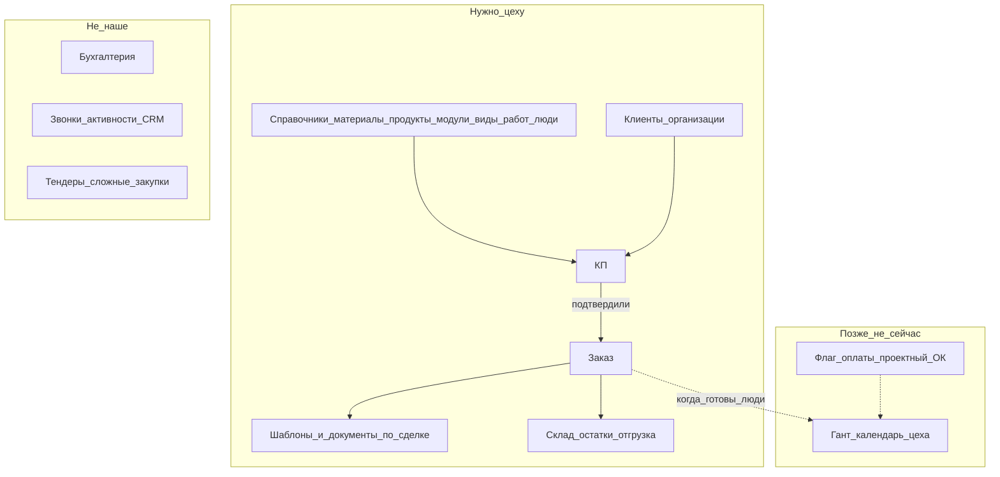
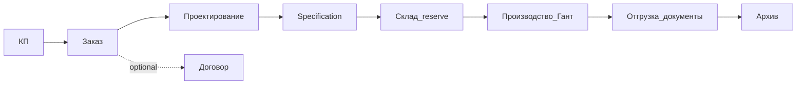

# Product vision (lite) — kppdf для небольшого цеха

**Статус:** канон для приоритизации TZ (2026-08-02). Не ТЗ на реализацию Ганта.  
**Масштаб:** ~10 пользователей. Сварка / покраска / дерево / отгрузка / КП / офис-документы.  
**Вне scope:** бухгалтерия, тяжёлый ERP-зоопарк, fine-grained «кнопка × кнопка» ACL.

## Роли (смысл, не каталог permissions)

| Роль | Кто | Видит / делает |
|------|-----|----------------|
| **Админ** | IT/владелец доступа | Пользователи, роли; назначает **Директора** |
| **Директор** | Руководитель | Почти всё для контроля; **галочками выдаёт сотрудникам разделы (страницы)** |
| **Менеджер** | Коммерция | КП → заказ/договор, клиенты, документы по сделке |
| **Работник** | Цех | Свои задачи/календарь (когда будет), склад по необходимости, без админки и чужих справочников |

Правило доступа Phase 1: **страница целиком да/нет** (пункт меню = раздел). Не прячем каждую кнопку отдельно — проще для 10 человек.

## Карта крупными блоками (для глаз)

**Журнал бизнес-логики:** отдельного «живого журнала» нет. Канон для приоритетов — этот файл; детали сущностей — `docs/data-model.md` (там много лишнего наследия модели, не всё = продукт для цеха).

## Сквозной поток (золотая середина)

1. Менеджер готовит **КП** (одна сущность, не три дубля в модели).  
2. КП подтвердили → **Заказ**.  
3. Заказ → модули / виды работ → люди (когда People готовы).  
4. Позже (backlog): диаграмма Ганта / календарь автораспределения после оплаты и «проектный ОК».  
5. Документы: шаблон → сформированный PDF/HTML по сделке.  
6. Склад: остатки/движения по мере необходимости, не второй SAP.

Сейчас в UI **нет** маршрута КП — это дыра потока №1. Гант — **не** сейчас.

## Карта потока → страницы (gap map, TZ-JOURNEY-301 + lifecycle plan 2026-08-02)

Статус легенда: ✅ UI есть · 🔶 half · ⛔ нет UI · 🅿️ parked · 🔜 ready-when-deps (спека есть, ждать цепочку).

| Шаг потока | Страница сейчас | Статус | Successor |
|------------|-----------------|--------|-----------|
| **КП** | — | ⛔ | TZ-SALES-301 |
| **Заказ** | `/orders` | ✅ | TZ-ORDERS-301 (конверсия из КП) |
| **Договор** | `/contracts` | ✅ *optional* | Не обязательный stage цепочки; юридический артефакт рядом с КП/заказом (см. lifecycle §10 #1) |
| **Проектирование** | — | ⛔ | TZ-PRODUCTION-301 (+ PRODUCTS-306 skip-flag) |
| **Specification** (снимок состава) | — | ⛔ | внутри PRODUCTION-301 / CORE-301 snapshots |
| **Склад reserve** | inventory routes ✅, glue ⛔ | 🔶 | TZ-INVENTORY-301 → PROCUREMENT-301 |
| **Производство / Гант** | — | 🔜 | PRODUCTION-302…307; [`GANT-calendar.md`](../tasks/_backlog/vision/GANT-calendar.md) |
| **Отгрузка + docs** | shipment partial | 🔶 | TZ-SHIPPING-301 + TZ-DOC-330 (order→template glue) |
| **Архив lifecycle** | documents page ✅, S7 link ⛔ | 🔶 | TZ-ARCHIVE-301 |
| **Модули / виды работ / люди** | routes ✅ / people 🔶 | ✅/🔶 | MODULES / WORKTYPES / WORKERS / UX-306 |
| **Auto-fill doc template** | DocConstructor ✅, order glue ⛔ | 🔶 | TZ-DOC-330 |

**Дыры №1:** КП без UI; проектирование/спека без UI; snapshot-immutability pattern (CORE-301) до цепочки.

## Что делаем сейчас vs паркуем

**Сейчас (лёгкие TZ):** page-ACL, закрытие UX-дыр меню, doc-constructor 324–326, People route, склад в nav, один КП-контур.  
**Парк:** Гант/календарь, авторазнос задач, проектный «готово к запуску», закупки/тендеры, финансы.

## Индекс задач

См. `docs/pages/PAGE-TZ-INDEX.md` и `tasks/TZ-ACCESS-*`, `TZ-JOURNEY-*`, `TZ-SALES-*`.
