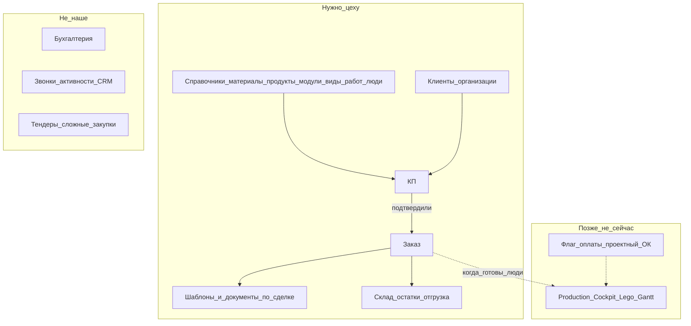
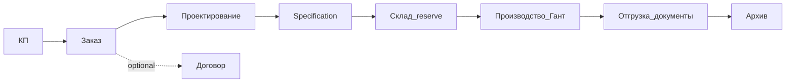

# Product vision (lite) — kppdf для небольшого цеха

**Статус:** канон для приоритизации TZ (2026-08-02). Не ТЗ на реализацию Ганта.  
**Масштаб:** ~10 пользователей. Сварка / покраска / дерево / отгрузка / КП / офис-документы.  
**Вне scope:** бухгалтерия, тяжёлый ERP-зоопарк, fine-grained «кнопка × кнопка» ACL.

## Роли (смысл, не каталог permissions)

| Роль | Кто | Видит / делает |
|------|-----|----------------|
| **Админ** | IT/владелец доступа | Пользователи, роли; назначает **Директора** |
| **Директор** | Руководитель | Почти всё для контроля; **галочками выдаёт сотрудникам разделы (страницы)** |
| **Менеджер** | Коммерция | КП → заказ/договор, клиенты, документы по сделке |
| **Работник** | Цех | Свои задачи/календарь (когда будет), склад по необходимости, без админки и чужих справочников |

Правило доступа Phase 1: **страница целиком да/нет** (пункт меню = раздел). Не прячем каждую кнопку отдельно — проще для 10 человек.

## Карта крупными блоками (для глаз)

**Журнал бизнес-логики:** отдельного «живого журнала» нет. Канон для приоритетов — этот файл; детали сущностей — `docs/data-model.md` (там много лишнего наследия модели, не всё = продукт для цеха).

## Сквозной поток (золотая середина)

1. Менеджер готовит **КП** (одна сущность, не три дубля в модели).  
2. КП подтвердили → **Заказ**.  
3. Заказ → модули / виды работ → люди (когда People готовы).  
4. Позже: **Production Cockpit** (Lego shell + Гант) — design `docs/superpowers/specs/2026-08-06-production-cockpit-lego-design.md`; first code TZ-PRODUCTION-303.  
5. Документы: шаблон → сформированный PDF/HTML по сделке.  
6. Склад: остатки/движения по мере необходимости, не второй SAP.

Сейчас в UI **нет** маршрута КП — это дыра потока №1. Гант — **не** сейчас.

## Карта потока → страницы (gap map, TZ-JOURNEY-301 + lifecycle plan 2026-08-02)

Статус легенда: ✅ UI есть · 🔶 half · ⛔ нет UI · 🅿️ parked · 🔜 ready-when-deps (спека есть, ждать цепочку).

| Шаг потока | Страница сейчас | Статус | Successor |
|------------|-----------------|--------|-----------|
| **КП** | — | ⛔ | TZ-SALES-301 |
| **Заказ** | `/orders` | ✅ | TZ-ORDERS-301 (конверсия из КП) |
| **Договор** | `/contracts` | ✅ *optional* | Не обязательный stage цепочки; юридический артефакт рядом с КП/заказом (см. lifecycle §10 #1) |
| **Проектирование** | — | ⛔ | TZ-PRODUCTION-301 (+ PRODUCTS-306 skip-flag) |
| **Specification** (снимок состава) | — | ⛔ | внутри PRODUCTION-301 / CORE-301 snapshots |
| **Склад reserve** | inventory routes ✅, glue ⛔ | 🔶 | TZ-INVENTORY-301 → PROCUREMENT-301 |
| **Производство / Гант** | — | 🔜 | PRODUCTION-302…307; [`GANT-calendar.md`](../tasks/_backlog/vision/GANT-calendar.md) |
| **Отгрузка + docs** | shipment partial | 🔶 | TZ-SHIPPING-301 + TZ-DOC-330 (order→template glue) |
| **Архив lifecycle** | documents page ✅, S7 link ⛔ | 🔶 | TZ-ARCHIVE-301 |
| **Модули / виды работ / люди** | routes ✅ / people 🔶 | ✅/🔶 | MODULES / WORKTYPES / WORKERS / UX-306 |
| **Auto-fill doc template** | DocConstructor ✅, order glue ⛔ | 🔶 | TZ-DOC-330 |

**Дыры №1:** КП без UI; проектирование/спека без UI; snapshot-immutability pattern (CORE-301) до цепочки.

## Что делаем сейчас vs паркуем

**Сейчас (лёгкие TZ):** page-ACL, закрытие UX-дыр меню, doc-constructor 324–326, People route, склад в nav, один КП-контур.  
**Парк:** Гант/календарь, авторазнос задач, проектный «готово к запуску», закупки/тендеры, финансы.

## Индекс задач

См. `docs/pages/PAGE-TZ-INDEX.md` и `tasks/TZ-ACCESS-*`, `TZ-JOURNEY-*`, `TZ-SALES-*`.

## Карта route → pageKey / capability (Phase 1)

Источник: peer-audit `docs/audits/2026-08-02-rbac-capability-gap-audit.md` Finding 1
+ `app.routes.ts` (2026-08-02). Phase 1 = **page целиком** (не кнопка×кнопка).
Gate сегодня: ⛔ нет page/capability CanMatch · ✅ capabilityRouteGuard.

| # | Route | pageKey | Capability (Phase 1) | Gate сейчас |
|--:|-------|---------|----------------------|-------------|
| 1 | `/materials` | `materials` | `page:materials` | ✅ ACCESS-303 |
| 2 | `/organizations` | `organizations` | `page:organizations` | ✅ |
| 3 | `/dictionaries` | `dictionaries` | `page:dictionaries` | ✅ |
| 4 | `/categories` | `categories` | `page:categories` | ✅ |
| 5 | `/doc-template-categories` | `doc-template-categories` | `page:doc-template-categories` | ✅ |
| 5b | `/dictionaries/text-block-categories` | `text-block-categories` | — | ✅ |
| 6 | `/color-references` | `color-references` | `page:color-references` | ✅ (+ admin/manager role) |
| 7 | `/products` | `products` | `page:products` | ✅ |
| 8 | `/products/:id` | `products` | `page:products` | ✅ |
| 9 | `/modules` | `modules` | `page:modules` | ✅ |
| 10 | `/modules/:id` | `modules` | `page:modules` | ✅ |
| 11 | `/work-types` | `work-types` | `page:work-types` | ✅ |
| 12 | `/orders` | `orders` | `page:orders` | ✅ |
| 13 | `/contracts` | `contracts` | `page:contracts` | ✅ |
| 14 | `/doc-constructor/templates` | `doc-templates` | `page:doc-templates` | ✅ |
| 15 | `/doc-constructor/documents` | `doc-documents` | `page:doc-documents` | ✅ |
| 16 | `/doc-constructor/texts` | `doc-texts` | `page:doc-texts` | ✅ |
| 17 | `/doc-constructor/tables` | `doc-tables` | `page:doc-tables` | ✅ |
| 18 | `/doc-constructor/builder/:id` | `doc-templates` | (same grant as registry) | ✅ |
| 19 | `/inventory` | `inventory` | `page:inventory` | ✅ |
| 20 | `/storage-items` | `storage-items` | `page:storage-items` | ✅ |
| 21 | `/stock-movements` | `stock-movements` | `page:stock-movements` | ✅ |
| 22 | `/admin` | `admin-users` | — | ✅ |
| 23 | `/admin/users` | `admin-users` | `user:admin` | ✅ |
| 24 | `/admin/roles` | `admin-roles` | `role:read` | ✅ |
| 25 | `/people` *(planned)* | `people` | `page:people` | — |
| 26 | `/proposals` | `proposals` | `page:proposals` | ✅ (+ admin/manager) |
| 27 | `/production/gantt` *(parked)* | `gantt` | `page:gantt` | — |
| 28 | `/login` + `/forbidden` | — | public / gateway | n/a |

Wiring: **TZ-ACCESS-303 DONE** (routes) + nav pageKeys (ACCESS-302/304 residual). Policy: `TZ-RBAC-302`.
`/auth/me` + `pages[]`: `TZ-ACCESS-301` + `TZ-RBAC-304`.
