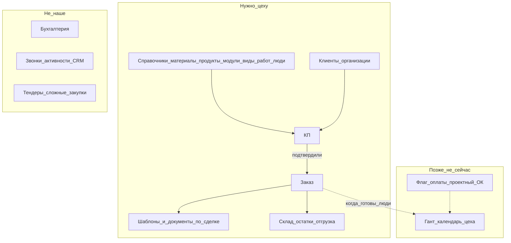
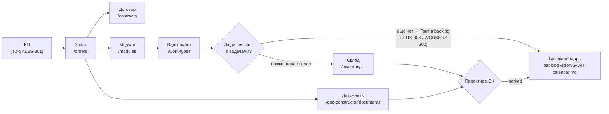

# Product vision (lite) — kppdf для небольшого цеха

**Статус:** канон для приоритизации TZ (2026-08-02). Не ТЗ на реализацию Ганта.  
**Масштаб:** ~10 пользователей. Сварка / покраска / дерево / отгрузка / КП / офис-документы.  
**Вне scope:** бухгалтерия, тяжёлый ERP-зоопарк, fine-grained «кнопка × кнопка» ACL.

## Роли (смысл, не каталог permissions)

| Роль | Кто | Видит / делает |
|------|-----|----------------|
| **Админ** | IT/владелец доступа | Пользователи, роли; назначает **Директора** |
| **Директор** | Руководитель | Почти всё для контроля; **галочками выдаёт сотрудникам разделы (страницы)** |
| **Менеджер** | Коммерция | КП → заказ/договор, клиенты, документы по сделке |
| **Работник** | Цех | Свои задачи/календарь (когда будет), склад по необходимости, без админки и чужих справочников |

Правило доступа Phase 1: **страница целиком да/нет** (пункт меню = раздел). Не прячем каждую кнопку отдельно — проще для 10 человек.

## Карта крупными блоками (для глаз)

**Журнал бизнес-логики:** отдельного «живого журнала» нет. Канон для приоритетов — этот файл; детали сущностей — `docs/data-model.md` (там много лишнего наследия модели, не всё = продукт для цеха).

## Сквозной поток (золотая середина)

1. Менеджер готовит **КП** (одна сущность, не три дубля в модели).  
2. КП подтвердили → **Заказ**.  
3. Заказ → модули / виды работ → люди (когда People готовы).  
4. Позже (backlog): диаграмма Ганта / календарь автораспределения после оплаты и «проектный ОК».  
5. Документы: шаблон → сформированный PDF/HTML по сделке.  
6. Склад: остатки/движения по мере необходимости, не второй SAP.

Сейчас в UI **нет** маршрута КП — это дыра потока №1. Гант — **не** сейчас.

## Карта потока → страницы (gap map, TZ-JOURNEY-301)

Статус легенда: ✅ UI есть · 🔶 half (каркас/частично) · ⛔ нет UI · 🅿️ parked (backlog).

| Шаг потока | Страница (route) сейчас | Статус | Successor / парк |
|------------|-------------------------|--------|------------------|
| **КП** | — (нет route) | ⛔ | [TZ-SALES-301](../tasks/TZ-SALES-301-proposal-thin-ui.md) — одна сущность Proposal + тонкий список |
| **Заказ** | `/orders` (orders.page.md) | ✅ | — |
| **Договор** | `/contracts` (contracts.page.md) | ✅ | — |
| **Модули** | `/modules`, `/modules/:id` | ✅ | MODULES-301/302 (материалы в модуле) |
| **Виды работ** | `/work-types` | ✅ | WORKTYPES-301/302 (люди в работах) |
| **Люди** | `/people` (каркас, WIP: TZ-WORKERS-302) | 🔶 | [TZ-UX-306](../tasks/TZ-UX-306-people-route-align.md) (route/nav) + [TZ-WORKERS-302](../tasks/TZ-WORKERS-302-people-page-and-person-card.md) (страница+карточка) |
| **Склад** | `/inventory`, `/storage-items`, `/stock-movements` | ✅ | MATERIALS-307/308/309, Z-001 (backend) |
| **Документы** | `/doc-constructor/documents` + builder | ✅ | DOC-324..326 (IA/палитра) |
| **Гант / календарь** | — (нет route) | 🅿️ | [`tasks/_backlog/vision/GANT-calendar.md`](../tasks/_backlog/vision/GANT-calendar.md) |
| **Проектное ОК** («готово к запуску») | — (флаг на заказе отсутствует) | 🅿️ | тот же GANT-calendar.md (scope: автопосле подтверждения) |

**Дыры потока №1:** КП без UI (главный вход менеджера) и люди-в-задачах (WorkTypes→People ещё не связаны).
**Не реализуются здесь:** карта фиксирует дыры как successor-IDs, никакого кода в этом TZ.

## Что делаем сейчас vs паркуем

**Сейчас (лёгкие TZ):** page-ACL, закрытие UX-дыр меню, doc-constructor 324–326, People route, склад в nav, один КП-контур.  
**Парк:** Гант/календарь, авторазнос задач, проектный «готово к запуску», закупки/тендеры, финансы.

## Индекс задач

См. `docs/pages/PAGE-TZ-INDEX.md` и `tasks/TZ-ACCESS-*`, `TZ-JOURNEY-*`, `TZ-SALES-*`.
